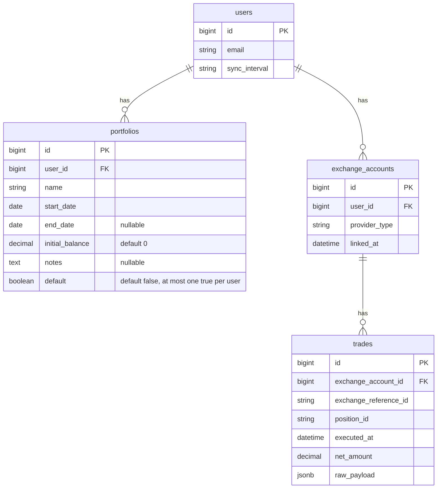

# feat: Dashboard, named portfolios, and trades tabs

---
title: Dashboard, named portfolios, and trades tabs
type: feat
status: active
date: 2026-02-26
source_brainstorm: docs/brainstorms/2026-02-26-dashboard-portfolios-trades-tabs-brainstorm.md
---

## Overview

Add named portfolios (date-windowed views over the same trades with optional initial balance), a tabbed Trades view (History vs Portfolio), rollback of the temporary 6‑month sync lookback, and a dashboard summary that shows the default portfolio or "All time" when no default is set.

**Context:** Brainstorm from 2026-02-26 (Dashboard, Portfolios, and Trades Tabs). Approach 2: portfolios + tabs + dashboard summary + optional notes. Export (CSV) deferred.

---

## Problem Statement / Motivation

- Users want to **segment time periods** (e.g. "March 2026", "Q1 2026") and see balance **from a floor** (e.g. start with $20).
- The current Trades page shows everything; there is no way to "start over" or focus on one period.
- The dashboard is minimal (exchange accounts only); users want a **summary of current period** (or all time) at a glance.
- Sync currently uses a temporary 6‑month lookback; revert to **linked_at** for day‑0 semantics and document API limits.

---

## Proposed Solution

1. **Portfolio model** — User-scoped; name, start_date, end_date (nullable), initial_balance (default 0), notes (optional), default (boolean; at most one true per user). Portfolios do not store trades; they define a date window and floor.
2. **Trades index** — Two tabs: **History** (all trades, current behavior) and **Portfolio** (dropdown to select portfolio; same table with trades filtered by portfolio start_date..end_date; balance = initial_balance + running P&L).
3. **Dashboard** — Keep exchange accounts; add a **summary block**: if user has a default portfolio, show its name, date range, period P&L, balance (initial_balance + sum net_pl in range), trade count; if no default, show "All time" (all trades, total balance). Link to Trades.
4. **Sync rollback** — Use `since = account.linked_at || account.created_at` again; remove temporary 6‑month comment; document in code or docs that BingX may expose limited history (90‑day fallback remains).

---

## Technical Considerations

- **Balance in portfolio view:** Reuse `PositionSummary.from_trades` and `assign_balance!`. For portfolio view, filter `current_user.trades` by `executed_at` in portfolio range, then pass `initial_balance` so displayed balance = `initial_balance + running P&L` (extend `assign_balance!` with an optional `initial_balance` parameter, or add it in the view layer).
- **Default portfolio:** Enforce "only one default per user" in a callback or validation (e.g. when setting `default = true`, set others to `false`).
- **End date null:** Null means "up to now"; filter with `executed_at >= start_date AND (end_date IS NULL OR executed_at <= end_date)`.
- **Tabs:** Use query param (e.g. `?view=history` | `?view=portfolio`) or segment (e.g. `/trades/history`, `/trades?portfolio_id=1`). Query param keeps one index action and avoids duplicate tables.
- **Dashboard "All time":** Reuse same PositionSummary logic: all trades, assign_balance!, total balance = last row balance (or sum of net_pl). No portfolio filter.

---

## Acceptance Criteria

- [x] **Rollback sync:** `SyncExchangeAccountJob` uses `since = account.linked_at || account.created_at`; temporary 6‑month lookback removed; 90‑day fallback in BingxClient unchanged.
- [x] **Portfolio CRUD:** User can create a portfolio with name, start_date, end_date (optional), initial_balance (optional, default 0), notes (optional). User can edit and delete. User can set one portfolio as default (only one default per user).
- [x] **Trades tabs:** Trades index has tabs "History" and "Portfolio". History shows all trades (current table). Portfolio tab shows a portfolio selector; selected portfolio filters trades by date range; balance column = portfolio initial_balance + running P&L.
- [x] **Dashboard summary:** Dashboard shows exchange accounts (existing) and a summary block: default portfolio (name, range, period P&L, balance, trade count) or "All time" (total balance, trade count) when no default. Link to Trades.
- [x] **Balance math:** In portfolio view, first row balance = initial_balance + (sum of net_pl in window); subsequent rows = initial_balance + cumulative P&L (newest first). History tab unchanged (balance from 0).
- [x] **Validation:** Portfolio start_date required; end_date optional; default uniqueness per user enforced.

---

## Implementation Phases

### Phase 1: Rollback sync + Portfolio model and CRUD

- [x] Revert `app/jobs/sync_exchange_account_job.rb`: `since = account.linked_at || account.created_at`; remove 6‑month comment.
- [x] Migration: create `portfolios` with `user_id`, `name`, `start_date` (date), `end_date` (date, null: true), `initial_balance` (decimal, default: 0), `notes` (text, null: true), `default` (boolean, default: false). Index `user_id`; unique index or callback so at most one `default = true` per user.
- [x] Model `Portfolio`: belongs_to :user; validates name, start_date; scope or callback to ensure single default per user (e.g. `before_save :clear_other_defaults` when default is true).
- [x] Routes: `resources :portfolios` under authenticated scope (or nested under user if preferred; resource is user-scoped).
- [x] Controllers: `PortfoliosController` (index, new, create, edit, update, destroy); `set_portfolio`; strong params: name, start_date, end_date, initial_balance, notes, default.
- [x] Views: index (list portfolios, link "Set as default"), new/edit form (name, start_date, end_date, initial_balance, notes, default checkbox). Link from dashboard or nav to portfolios.
- [x] User: `has_many :portfolios`; `has_one :default_portfolio` (optional scope) or `def default_portfolio` method.

**Files to add/change:** `db/migrate/..._create_portfolios.rb`, `app/models/portfolio.rb`, `app/controllers/portfolios_controller.rb`, `app/views/portfolios/` (index, new, edit, _form), `config/routes.rb`, `app/models/user.rb`.

### Phase 2: Trades index tabs and portfolio filter

- [x] TradesController: accept `view` (history | portfolio) and `portfolio_id`. When view=portfolio and portfolio_id present, load portfolio (user-scoped), filter trades by `executed_at >= start_date AND (end_date.nil? OR executed_at <= end_date)`, build @positions, call `PositionSummary.assign_balance!(@positions, initial_balance: portfolio.initial_balance)` (or add initial_balance in view). When view=history or no portfolio, current behavior (all trades, balance from 0).
- [x] Extend `PositionSummary.assign_balance!` to accept optional `initial_balance:` (default 0); add to each summary’s balance after computing running sum.
- [x] Trades index view: render tabs (History | Portfolio). When Portfolio tab active, show dropdown of user’s portfolios; table shows positions for selected portfolio (or empty state). Balance column already uses `pos.balance` (now includes initial_balance when in portfolio mode).
- [x] Nav or dashboard: link to Trades with optional `?view=portfolio&portfolio_id=X` for default portfolio.

**Files to change:** `app/controllers/trades_controller.rb`, `app/models/position_summary.rb`, `app/views/trades/index.html.erb`, `config/routes.rb` (if adding portfolio_id in path optional).

### Phase 3: Dashboard summary

- [x] DashboardsController: load `@default_portfolio = current_user.portfolios.find_by(default: true)`. If present, compute period P&L and balance (trades in range, PositionSummary logic or simple sum); if not, compute "All time" total balance and trade count from `current_user.trades`.
- [x] Dashboard view: add section "Portfolio summary" (or "Period summary"): if @default_portfolio show name, date range, period P&L, balance (initial_balance + sum net_pl), position count; else show "All time" with total balance and count. Link "View trades" to trades_path (or trades_path(view: 'portfolio', portfolio_id: @default_portfolio.id) when default set).
- [x] Optional: link "Manage portfolios" to portfolios_path.

**Files to change:** `app/controllers/dashboards_controller.rb`, `app/views/dashboards/show.html.erb`.

---

## Data Model (ERD)

---

## Dependencies & Risks

- **Dependencies:** None beyond current stack (Rails, Tailwind, existing Trade/PositionSummary).
- **Risks:** Default portfolio uniqueness must be enforced (validation/callback). Edge case: portfolio with end_date in future — treat as "to now" for filtering (end_date nil vs future can be clarified; brainstorm says null = "to now", so future end_date could mean "show until this date" for planned periods).

---

## Success Metrics

- User can create a portfolio with a floor (e.g. $20) and see balance = 20 + P&L in that window.
- User can switch between "all history" and a selected portfolio on Trades without leaving the page.
- Dashboard shows at a glance either default portfolio summary or All time summary.
- Sync uses linked_at; no duplicate trades; 90‑day fallback still works when API returns empty for long range.

---

## References & Research

### Internal

- [Brainstorm: 2026-02-26 Dashboard, Portfolios, and Trades Tabs](../brainstorms/2026-02-26-dashboard-portfolios-trades-tabs-brainstorm.md)
- Existing patterns: `app/controllers/trades_controller.rb` (PositionSummary.from_trades, assign_balance!), `app/views/trades/index.html.erb`, `app/views/dashboards/show.html.erb`, `app/jobs/sync_exchange_account_job.rb`

### External

- Rails conventions: RESTful resources, strong params, scoped finds (e.g. `current_user.portfolios`).
