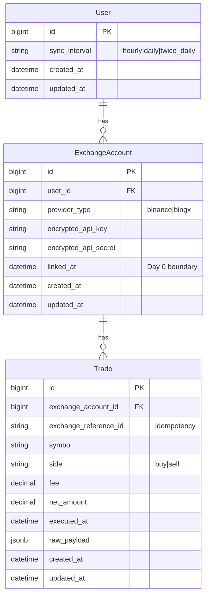

# feat: Multi-Exchange Automated Trade Logger (MVP)

## Enhancement Summary

**Deepened on:** 2026-02-26  
**Sections enhanced:** Overview, Technical Approach, Phase 1 & 3, Acceptance Criteria, new UI/UX section, Solid Queue production notes.  
**Research focus:** Clean/polished/professional UI, Rails 8 + Tailwind, SaaS dashboard patterns, Solid Queue production tuning.

### Key Improvements

1. **UI/UX elevated to must-have:** Interface must be clean, polished, and professional; design tokens, consistent typography/spacing, and professional dashboard patterns (trades list, settings, link-account flow) are in scope.
2. **Concrete UI stack and patterns:** Rails 8 with Tailwind CSS (e.g. `rails new --css tailwind`), 12-column grid, progressive disclosure, sortable tables for trades; optional RailsUI or component library for speed.
3. **Solid Queue production guidance:** Optional separate queue DB to avoid blocking web; dispatcher + child job pattern confirmed; recurring.yml for dispatcher only.
4. **Explicit quality bar:** Success includes “looks and feels professional” for traders; no rough or placeholder UI.

### New Considerations Discovered

- Consider separate queue database in production if connection pool pressure appears (start single-DB, split if needed).
- Tailwind v4 (Rails 8 default) uses CSS-first config and design tokens—use for consistent, scalable dashboard styling.
- F-pattern layout and above-the-fold placement for key metrics/actions improve task completion; apply to dashboard and trade list.

---

## Overview

Build a Rails 8 "set and forget" app that centralizes trade activity from multiple exchanges (Binance, BingX) without manual entry. Users link read-only API keys; the system syncs trades on a per-user schedule (Hourly, Daily, Twice daily at 08:00/20:00 UTC), enforces a per-account rate limit (max 2 syncs/day), and stores a unified trade log. Stack: Solid Queue only (no Redis), ActiveRecord::Encryption for credentials, Kamal for deployment. **UI/UX must be clean, polished, and professional**—no rough or placeholder interfaces; traders should see a cohesive, trustworthy dashboard and flows. Appetite: 2–3 weeks; balance sync engine/data schema with a presentable, professional interface.

## Problem Statement

Manual trade journaling is high-friction and leads to data gaps and emotional bias. Traders need automated, accurate performance tracking across platforms with no ongoing manual steps and no write access to exchange accounts.

## Proposed Solution

- **Exchange-agnostic core:** Abstract `ExchangeProvider`; Binance and BingX implement it; unified `Trade` model. Adding an exchange = new provider class, no DB migration.
- **Per-user sync config:** User has one interval (Hourly, Daily, Twice daily). Config drives Solid Queue via a **dispatcher job** at a fixed cadence that enqueues **per-account sync jobs** only for accounts due and under the 2/day cap.
- **Sync loop:** Poll exchange "My Trades", filter USDT/USDC, compute net = (Price × Qty) − Commission, persist with `exchange_reference_id` for idempotency. Day 0: only trades with `executed_at >= account.linked_at`.
- **Security:** Encrypt API key/secret on `ExchangeAccount` (Active Record Encryption). Reject keys with Trade or Withdraw permissions before storing.
- **Deployment:** Kamal 2 for web + Solid Queue worker roles; no Redis.
- **UI/UX:** Clean, polished, professional interface: consistent design tokens, clear hierarchy, professional dashboard and trade list; Tailwind CSS; avoid placeholder or rough UI.

## Technical Approach

### Architecture

- **Models:** `User` (has `sync_interval`), `ExchangeAccount` (belongs_to User, `provider_type`, encrypted credentials, `linked_at`), `Trade` (belongs_to ExchangeAccount, unified schema).
- **Providers:** `Exchanges::BaseProvider` (abstract interface: `#fetch_my_trades(since:)` returning normalized structs). `Exchanges::BinanceClient`, `Exchanges::BingxClient` implement it and normalize exchange-specific trade/order semantics.
- **Jobs:** One recurring **dispatcher** (e.g. every 15–30 min) reads `config/recurring.yml`. It finds users whose `sync_interval` and last run times imply a run is due, then for each user’s accounts due and under 2 runs today, enqueues `SyncExchangeAccountJob`. **Rate limit:** in dispatcher or in job: count today’s sync runs for the account (e.g. `SolidQueue::Job` or a `sync_runs` log table) and skip if ≥ 2.
- **Twice daily:** Dispatcher runs at fixed times (e.g. 08:00 and 20:00 UTC); only users with `sync_interval: twice_daily` get child jobs at those times.

### Research Insights (Solid Queue & architecture)

**Production tuning:** For production, consider a separate queue database in `config/database.yml` (e.g. `queue:` with its own DB) so job processing doesn’t exhaust the primary connection pool; start with a single DB and split only if needed. Solid Queue uses Workers (poll), Dispatcher (route), and Scheduler (recurring); suitable for moderate volume (< 1000 jobs/min). Recurring jobs are defined in `config/recurring.yml`; use a single recurring entry for the dispatcher; dispatcher enqueues per-account child jobs from DB state.

**References:** [Solid Queue Rails 8 setup and production](https://nsinenko.com/rails/background-jobs/performance/2025/10/07/solid-queue-rails-practical-guide.html), [Solid Queue recurring jobs](https://jbennett.me/articles/recurring-jobs-with-solid-queue/), [rails/solid_queue](https://github.com/rails/solid_queue).

### Data Model (ERD)

### Implementation Phases

#### Phase 1: Foundation (Rails app, auth, models, encryption)

- [x] New Rails 8 app with **Tailwind CSS** (`rails new app-name --css tailwind` or add `tailwindcss-rails`); PostgreSQL; add `solid_queue`, Kamal.
- [x] Authentication (Devise or built-in Rails 8 auth) so we have `current_user`.
- [x] Models: `User`, `ExchangeAccount`, `Trade` with migrations; unique index on `[exchange_account_id, exchange_reference_id]` for idempotency.
- [x] `User.sync_interval` (enum or string: `hourly`, `daily`, `twice_daily`).
- [x] ActiveRecord::Encryption: `bin/rails db:encryption:init`; store keys in credentials or ENV; `encrypts :api_key, :api_secret` on `ExchangeAccount` (store in `encrypted_api_key`, `encrypted_api_secret` or single credential blob).
- [x] Key validation: before save, call exchange API (or key permissions endpoint) and reject if key has Trade/Withdraw; store `linked_at` on first successful link.
- [x] Rails conventions: RESTful routes, service objects for exchange calls, keep controllers thin.
- [x] **UI baseline:** Layout and typography consistent from day one (Tailwind design tokens or theme); sign-in/sign-up and link-account forms clean and error-aware; no raw unstyled forms.

**Deliverables:** App runs; user can sign up; user can create ExchangeAccount with API key/secret (validated, encrypted); UI is presentable and consistent. No sync yet.

**Estimated effort:** ~3–5 days.

#### Phase 2: Exchange providers and sync job

- [x] `Exchanges::BaseProvider` abstract interface: `#fetch_my_trades(since:)` → array of normalized hashes (symbol, side, fee, net_amount, executed_at, exchange_reference_id).
- [x] `Exchanges::BingxClient` implements BaseProvider (BingX only for MVP); normalizes BingX order history; filter USDT/USDC only; compute net_amount = (price × qty) − commission.
- [x] `SyncExchangeAccountJob(account_id)`: load account, decrypt credentials, call provider `fetch_my_trades(since: account.linked_at)`, upsert `Trade` by `exchange_reference_id` (idempotent). Rescue API errors and log/retry.
- [x] Rate limit: `SyncRun` model + `ExchangeAccount#can_sync?` (max 2 runs/day UTC); job creates SyncRun only on success.
- [x] Day 0: pass `account.linked_at` as `since` so only trades on or after link date are fetched.

**Deliverables:** Manual trigger of `SyncExchangeAccountJob` for an account populates `Trade`; no duplicate trades; rate limit enforced.

**Estimated effort:** ~4–6 days.

#### Phase 3: Per-user scheduler and config UI

- [x] Dispatcher job (`SyncDispatcherJob`) enqueued by Solid Queue recurring every 15 min. Selects users with `sync_interval` set who are due (hourly/daily/twice_daily); for each, enqueues `SyncExchangeAccountJob` for BingX accounts under 2 runs today.
- [x] Last-run tracking: `ExchangeAccount.last_synced_at` and `SyncRun`; dispatcher uses max(last_synced_at) per user to compute “due”.
- [x] **User config UI:** Settings page with radio group for sync interval (Hourly, Daily, Twice daily); clear labels, current value, last sync hint. Matches app Tailwind design.
- [x] Twice daily: dispatcher only enqueues for twice_daily users when UTC hour is 8 or 20; slot-based “due” so one run per slot.

**Deliverables:** Recurring sync runs without manual trigger; user can change interval in a polished settings UI; rate limit and interval respected.

**Estimated effort:** ~2–4 days.

#### Phase 4: Kamal deployment

- [x] `bundle exec kamal init`; configure `config/deploy.yml`: server(s), registry, env (e.g. `RAILS_MASTER_KEY`, encryption keys, DB URL).
- [ ] Roles: web (Rails server) and job (Solid Queue worker). Kamal runs Solid Queue worker on job role.
- [ ] `kamal setup` then `kamal deploy`; verify migrations run, web and worker start; ensure encryption keys and secrets available in production.
- [ ] Document: how to set env and secrets for Kamal (credentials, ENV).

**Deliverables:** App deployable with Kamal; web + worker running; conventions documented.

**Estimated effort:** ~1–2 days.

---

## UI/UX: Clean, Polished, Professional

The product must present a **clean, polished, and professional** experience so traders trust the tool. Apply the following from the start.

### Design System & Stack

- **Tailwind CSS** with Rails 8 (`rails new --css tailwind` or `tailwindcss-rails`). Use **design tokens** (colors, typography, spacing) for consistency; Tailwind v4’s CSS-first theme makes this straightforward.
- **Layout:** 12-column grid, 8px-based spacing; critical actions and key metrics above the fold where possible (F-pattern).
- **Progressive disclosure:** Show essential info first (e.g. trade list summary, sync status); expand or link to detail where needed; avoid overwhelming single screens.

### Key Screens

| Screen | Goal |
|--------|------|
| **Sign-in / Sign-up** | Clear, minimal forms; visible validation and error messages. |
| **Link exchange account** | Step-wise or single form; explain read-only keys; clear success/error and “key rejected” states. |
| **Settings (sync interval)** | Obvious control (e.g. radio group or select) with labels; show current value and optional “next sync” hint. |
| **Trade list (index)** | Readable table: sortable columns (e.g. date, symbol, side, net amount), clear headers, row hierarchy; optional exchange badge; no cramped or unstyled tables. |

### Research Insights

**Best practices:** Dashboards that follow clear hierarchy and F-pattern layout see strong task completion; consistency in components (buttons, inputs, cards) and spacing builds trust. Use Tailwind utilities in reusable components (e.g. cards, form groups) rather than one-off classes. Consider a small component library (e.g. RailsUI, Flowbite, or custom) for tables and forms to ship faster while staying on-brand.

**Avoid:** Raw HTML forms with no styling; inconsistent spacing or type scale; dense tables with no breathing room; placeholder “lorem” or obvious defaults in production.

**References:** [Tailwind + Rails 8](https://medium.com/@johannesphil/tailwind-css-rails-8-a-quick-setup-guide-for-server-rendered-apps-53d934c9704a), [SaaS dashboard best practices](https://designx.co/saas-dashboard-design-best-practices/), [Tailwind design tokens](https://www.frontendtools.tech/blog/tailwind-css-best-practices-design-system-patterns).

---

## Alternative Approaches Considered

- **Static recurring.yml per user:** Solid Queue’s `recurring.yml` is static; we’d need one entry per user/account, which doesn’t scale. **Chosen:** single recurring dispatcher that reads DB and enqueues per-account jobs.
- **Redis-backed job queue:** Rejected per appetite; stack must stay Solid (DB-backed).
- **Historical sync (backfill):** Rejected for MVP; Day 0 only.

---

## Acceptance Criteria

### Functional

- [ ] User can register and sign in.
- [ ] User can add an exchange account (Binance or BingX) with API key/secret; keys are validated (read-only) and rejected if they have Trade/Withdraw permissions.
- [ ] API key and secret are stored encrypted (Active Record Encryption).
- [ ] User can set sync interval to Hourly, Daily, or Twice daily (one setting for all linked accounts).
- [ ] Trades sync automatically per user interval; only trades with `executed_at >= account.linked_at` are imported; only USDT/USDC pairs.
- [ ] Each exchange account is synced at most 2 times per calendar day (UTC).
- [ ] Trades are stored once per exchange reference (idempotent by `exchange_reference_id`); net amount = (price × quantity) − commission.
- [ ] User can view a list of trades (clean, readable index with sortable columns and clear hierarchy); data comes from unified `Trade` model regardless of exchange.

### Non-Functional

- [ ] **UI/UX:** Interface is clean, polished, and professional: consistent typography and spacing (design tokens), clear visual hierarchy, no placeholder or rough UI; dashboard/trade list/settings feel cohesive and trustworthy.

- [ ] No Redis; Solid Queue only for background jobs.
- [ ] Deploy with Kamal (web + Solid Queue worker).
- [ ] Code follows Rails conventions (RESTful, service objects for sync, encryption and Solid Queue used as intended).
- [ ] Sensitive attributes (API key/secret) not logged or exposed in responses.

### Quality Gates

- [ ] Test coverage for: key validation, provider normalization, sync job idempotency, rate limit and dispatcher logic (unit or integration as appropriate).
- [ ] Code review for convention adherence and security (no raw credentials in logs).
- [ ] UI review: sign-in/sign-up, link account, settings, and trade list meet “clean, polished, professional” bar (layout, type, spacing, feedback).

### SpecFlow Notes (edge cases)

- **First link:** On first successful link, set `linked_at = Time.current`; first sync uses this as `since` (Day 0).
- **API failure / timeout:** Sync job should rescue exchange errors, log, and optionally retry (Solid Queue retry); do not mark as successful so rate limit doesn’t count failed runs as one of the 2/day if desired (clarify in implementation).
- **Duplicate trades:** Upsert by `[exchange_account_id, exchange_reference_id]` so re-sync doesn’t create duplicates.
- **Twice daily timing:** Dispatcher runs at 08:00 and 20:00 UTC; users with `twice_daily` get jobs only at those times (and still max 2/day per account).

---

## Success Metrics

- All acceptance criteria pass.
- A user can link Binance and BingX, set interval to Twice daily, and see trades from both in one list within 24 hours.
- Deploy to staging/production with Kamal and run sync without errors.
- **UI/UX:** The app looks and feels professional—no rough or placeholder UI; traders would be comfortable using it daily.

---

## Dependencies & Prerequisites

- Ruby 3.x, Rails 8, PostgreSQL.
- Binance and BingX API docs (read-only endpoints for “my trades” and key permissions).
- Server(s) with Docker and SSH for Kamal; registry for images.
- Encryption keys generated and stored (credentials or ENV) for dev and prod.

---

## Risk Analysis & Mitigation

| Risk | Mitigation |
|------|------------|
| Exchange API rate limits | Per-account 2/day cap; respect exchange-specific headers if needed later. |
| Binance vs BingX API differences | BaseProvider normalizes to common struct; each client handles its own semantics. |
| Solid Queue scheduler not loading | Document known issues (e.g. Supervisor vs Scheduler); ensure recurring task is registered and runner started. |
| Credentials leakage | Encrypt at rest; filter encrypted attributes in logs; review env handling in Kamal. |

---

## Future Considerations

- More exchanges (new provider class only).
- Richer trade list UI (filters, export, charts); MVP keeps it clean and professional with sortable table.
- Alerts or webhooks on sync failure (out of scope for MVP).
- Dark mode or theme toggle if design system is built with tokens from the start.

---

## References & Research

### Internal

- [Brainstorm: 2026-02-26 Multi-Exchange Trade Logger MVP](../brainstorms/2026-02-26-multi-exchange-trade-logger-mvp-brainstorm.md)
- [Shaping: Multi-Exchange Automated Trade Logger](../shaping.md)

### External

- [Solid Queue recurring jobs](https://github.com/rails/solid_queue) — use dispatcher + child job pattern for per-user scheduling.
- [Active Record Encryption](https://guides.rubyonrails.org/active_record_encryption.html) — `encrypts` for API key/secret; `db:encryption:init`.
- [Kamal 2 Rails deployment](https://kamal-deploy.org/) — `kamal init`, deploy.yml roles for web and job (Solid Queue worker).
- [Tailwind CSS + Rails 8](https://medium.com/@johannesphil/tailwind-css-rails-8-a-quick-setup-guide-for-server-rendered-apps-53d934c9704a) — setup and asset pipeline.
- [SaaS dashboard best practices](https://designx.co/saas-dashboard-design-best-practices/) — layout, hierarchy, tables.
- [Tailwind design tokens & patterns](https://www.frontendtools.tech/blog/tailwind-css-best-practices-design-system-patterns) — consistent, scalable UI.
