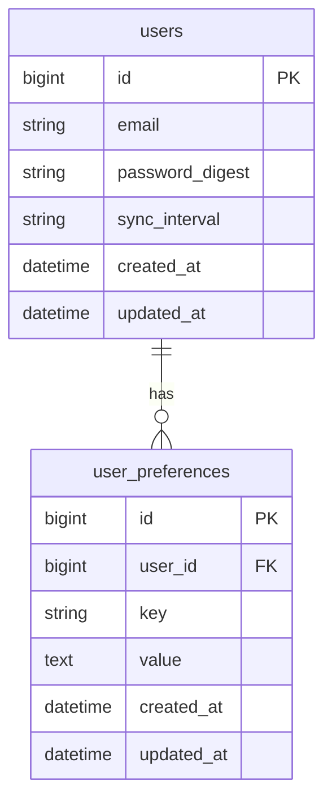

# feat: Trades index configurable columns and entry/exit columns

---
title: Trades index configurable columns and entry/exit columns
type: feat
status: active
date: 2026-03-06
source_brainstorm: docs/brainstorms/2026-03-06-trades-index-columns-configurable-brainstorm.md
---

## Enhancement Summary

**Deepened on:** 2026-03-06  
**Sections enhanced:** Proposed Solution, Technical Considerations, User Flows, Persistence (migration).  
**Research sources:** Rails user-preferences patterns (key-value table, JSONB), HTML `<dialog>` + Stimulus accessibility, migration safety and unique-index upsert patterns.

### Key improvements

1. **Persistence:** Use `jsonb` for `value` (PostgreSQL) and composite unique index `[user_id, key]`; upsert via `find_or_initialize_by` + save (or rescue `RecordNotUnique` on race). Avoid querying by value—preferences are load-once per request for display only.
2. **Modal:** Native `<dialog>` + Stimulus controller gives Esc-to-close, focus trap, and inert backdrop without extra libraries; form can POST to a dedicated endpoint and redirect back or use Turbo for in-place update.
3. **Migration:** Reversible migration; `null: false` on `user_id` and `key`; add unique index after table creation; no GIN on `value` unless you need to query inside JSON later.

### New considerations

- **Race condition:** Two concurrent saves for the same user/key can raise `ActiveRecord::RecordNotUnique`; rescue and retry with `find_by` + update, or use advisory locking, or accept rare failure and ask user to retry.
- **Accessibility:** Ensure modal has a visible focus target (e.g. first checkbox or "Save"), and that the column-control button has an `aria-label` (e.g. "Choose columns").

---

## Overview

Add high-value columns (entry price, and optionally exit price, open date, quantity) to the trades index table, and make column visibility configurable per user. A control in the top right of the table opens a modal where users can select/unselect columns; the selection is persisted in a new `user_preferences` table and shared between History and Portfolio views.

## Problem Statement / Motivation

- Traders want to see **entry price** (entry point) on each trade for quick comparison with current or exit price.
- Additional columns (exit price, open date, quantity) add context and value but would clutter the table for users who don’t want them.
- Users need **configurable column visibility** with a **saved preference** that persists across sessions and devices (new table, not cookies).

## Proposed Solution

1. **New columns (data)**  
   - **Entry price** — already on `PositionSummary#entry_price`; add to table.  
   - **Exit price** — add `PositionSummary#exit_price` (from closing trade’s `avgPrice` / notional when present); show for closed rows only.  
   - **Open date** — `PositionSummary#open_at`; format e.g. `%Y-%m-%d`.  
   - **Quantity** — `PositionSummary#open_quantity` or `closed_quantity` as appropriate for the row.

2. **Column visibility configuration**  
   - Define a fixed list of column IDs (e.g. `closed`, `exchange`, `symbol`, `side`, `leverage`, `margin_used`, `roi`, `commission`, `net_pl`, `balance`, `entry_price`, `exit_price`, `open_date`, `quantity`).  
   - Default visible set: current 10 columns + `entry_price`. New optional columns (`exit_price`, `open_date`, `quantity`) can be default-on or opt-in (product choice).

3. **UI**  
   - **Control:** Button or icon (e.g. “Columns” or gear/list icon) in the **top right** of the table area (same row as table, right-aligned). Only show when `@positions.any?`.  
   - **Modal:** Clicking opens a modal with a list of columns and checkboxes (or toggles). User checks/unchecks, then **Save** (persist and close) or **Cancel** (close without saving). At least one column must remain visible (validation or disable Save when none selected).  
   - **Rendering:** Table header and body render only columns whose ID is in the user’s visible set (from preference or default).

4. **Persistence**  
   - New table **`user_preferences`**: `user_id` (FK), `key` (string), `value` (text or jsonb).  
   - For trades index columns: `key = "trades_index_visible_columns"`, `value` = JSON array of column IDs, e.g. `["closed","exchange","symbol",...,"entry_price"]`.  
   - One row per user per key (upsert on save). Load once per request when rendering the trades index (e.g. in controller or a helper that the view uses).

### Research insights (Persistence)

- **PostgreSQL:** Prefer `jsonb` for `value` so the column is typed and queryable later if needed; no GIN index required if you only ever load by `user_id` + `key`.
- **Upsert:** Use `UserPreference.find_or_initialize_by(user_id:, key:)` then assign `value` and `save`; add a composite unique index `add_index :user_preferences, [:user_id, :key], unique: true` so the row is unique. If two requests race, rescue `ActiveRecord::RecordNotUnique` and retry with `find_by` + `update`.
- **Migration safety:** Make the migration reversible (`change` with `create_table`/`drop_table`); set `null: false` on `user_id` and `key`; add the unique index in the same migration so no duplicates can be created.

## Technical Considerations

- **PositionSummary#exit_price:** For a closed leg, `trades.last` is the closing trade; from its `raw_payload` use `avgPrice` / `avg_price` or `notional_from_raw / closed_quantity`. Return `nil` when `open?` or when closing trade has no price. Add unit tests in `test/models/position_summary_test.rb`.
- **Column registry:** Keep a single source of truth for column IDs and labels (e.g. a constant or a small class in `app/models/` or `app/helpers/`). View and modal use this to render headers and checkboxes; preference stores only IDs.
- **Default when no preference:** If the user has no `user_preferences` row for `trades_index_visible_columns`, use the default list (current 10 + entry_price). Same for new users.
- **New columns in future:** When adding a new column ID in code, decide whether it’s “visible by default” or “hidden by default”; if visible by default, existing users who already have a saved preference might not see it until they add it in the modal (acceptable) or you can merge “default visible” into saved preference on load (optional enhancement).
- **Modal implementation:** No existing modal in the app. Options: (1) HTML `<dialog>` with a Stimulus controller to open/close and submit via Turbo or a small AJAX/form request, or (2) a dedicated route that renders a modal partial and updates via Turbo Frame. Prefer simple: `<dialog>` + form that POSTs to a new endpoint (e.g. `PATCH /settings/trades_columns` or `POST /user_preferences`) and redirects back to trades index with notice, or returns 204 and the page refreshes column state via a full reload. Alternatively, persist via fetch and then re-render the table with a Turbo Stream or full page reload.
- **History vs Portfolio:** Same `trades_index_visible_columns` preference for both views; controller passes the same visible columns to the view regardless of `view` or `portfolio_id`.

### Research insights (Modal & UI)

- **Native `<dialog>`:** Use the HTML5 `<dialog>` element with `showModal()` / `close()`; it provides Esc to close, focus trapping, and inert backdrop. No extra JS library needed; well supported in modern browsers.
- **Stimulus controller:** Minimal controller with targets `dialog` and actions `open` / `close`; e.g. `this.dialogTarget.showModal()` and `this.dialogTarget.close()`. Form inside the dialog can use `data-turbo="true"` and a POST to your preferences endpoint; on success, redirect back to trades index so the next render uses the new preference.
- **Accessibility:** Give the column-control button an `aria-label` (e.g. "Choose columns"). Ensure the first focusable element in the modal is visible (e.g. first checkbox or Save button). Avoid removing "Cancel" so keyboard users can close without saving.

## User Flows / Edge Cases

- **First visit (no preference):** User sees default columns (current 10 + entry price). Opening the modal shows all columns with defaults checked; Save creates the first `user_preferences` row.
- **Returning user:** Visible columns loaded from `user_preferences`; table and modal reflect saved selection.
- **Save with at least one column:** Validation (client or server) ensures at least one column remains selected; otherwise Save is disabled or returns validation error.
- **Cancel:** Modal close without saving leaves preference unchanged; table unchanged.
- **New column in code later:** If a new column ID is added to the registry, existing saved preferences do not include it; product decision: show new column by default for everyone (merge into default when preference exists) or hide until user enables it (simplest: hide until enabled).

### Research insights (Flows)

- **Validation:** Enforce "at least one column" on the server as well as in the UI (e.g. disable Save when none selected). Prevents malformed JSON or direct API calls from saving an empty array.
- **Performance:** Loading preference is one extra query per trades index request (`UserPreference.find_by(user_id: current_user.id, key: "trades_index_visible_columns")`). No N+1; consider `current_user.user_preferences.find_by(key: ...)` if you already load `user_preferences` elsewhere.

## Acceptance Criteria

- [x] **Entry price column:** Table can show an “Entry price” column; value from `PositionSummary#entry_price`; formatted like other prices (e.g. `format_money` or number_with_precision as appropriate). Shown when the column is in the user’s visible set.
- [x] **Exit price (optional):** `PositionSummary#exit_price` implemented; table can show “Exit price” for closed rows (e.g. “—” when open). Visible when in the user’s visible set.
- [x] **Open date column:** Table can show “Open date” from `pos.open_at`; visible when in the user’s visible set.
- [x] **Quantity column:** Table can show quantity (open or closed as appropriate); visible when in the user’s visible set.
- [x] **Column selector control:** When the table has rows, a control in the top right of the table area opens a modal. Modal lists all available columns with checkboxes; user can select/unselect; at least one column must be selected to save.
- [x] **Save preference:** Saving in the modal persists the selected column IDs to `user_preferences` (key `trades_index_visible_columns`). On next load of the trades index (History or Portfolio), the table shows only those columns.
- [x] **Default:** If the user has no saved preference, the table shows the default set (current 10 columns + entry price).
- [x] **One config for both views:** Same visible columns in History and Portfolio.
- [x] **Migration and model:** `user_preferences` table exists with `user_id`, `key`, `value` (+ timestamps); unique index on `[user_id, key]`; model `UserPreference` with validations and `User has_many :user_preferences`.

## Success Metrics

- Users can see entry price (and optionally exit price, open date, quantity) without clutter.
- Column choice persists across sessions and devices.
- No regression in existing trades index behavior when preference is unset (default columns).

## Dependencies & Risks

- **Risks:** None critical. Modal and preference load add minimal complexity.
- **Dependencies:** None external. Builds on existing `TradesController`, `Trades::IndexService`, and `PositionSummary`.

## References & Research

### Internal

- Brainstorm: `docs/brainstorms/2026-03-06-trades-index-columns-configurable-brainstorm.md`
- Trades index view: `app/views/trades/index.html.erb`
- PositionSummary: `app/models/position_summary.rb` (`entry_price`, `open_at`, `open_quantity`, `closed_quantity`; closing trade = `trades.last` in leg rows)
- Settings pattern: `app/controllers/settings_controller.rb`, `app/views/settings/show.html.erb` (form + update on User)
- Stimulus: `app/javascript/controllers/` (e.g. `dashboard_charts_controller.js`) for optional modal behavior

### External (deepen-plan)

- Native HTML dialog with Rails and Stimulus: https://www.koffeinfrei.org/2026/01/21/native-html-dialogs-with-ruby-on-rails-and-stimulus/
- Hotwire modals with Stimulus and Turbo Frames: https://blog.appsignal.com/2024/02/21/hotwire-modals-in-ruby-on-rails-with-stimulus-and-turbo-frames.html
- Rails unique index and upsert: composite `add_index :table, [:user_id, :key], unique: true`; use `find_or_initialize_by` and rescue `ActiveRecord::RecordNotUnique` on concurrent saves.
- User preferences in Rails: key-value table with `jsonb` for value; avoid querying by value for UI-only preferences.
