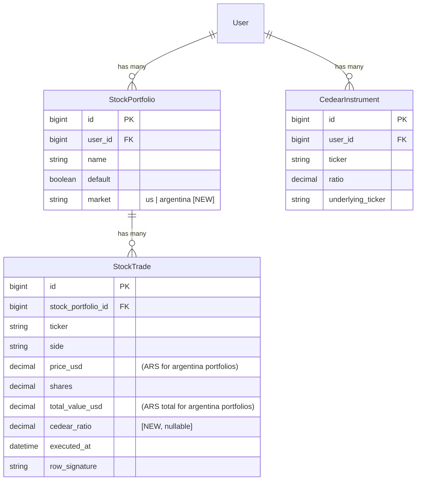

# feat: CEDEAR / Argentina Stock Market Support

## Overview

Add per-portfolio market mode to the stocks feature: **US** (existing Finnhub-based flow) or **Argentina (CEDEARs)**. CEDEARs are Argentine certificates representing fractional ownership of US-listed stocks. They trade in ARS and require a CEDEAR ratio (e.g. 10 CEDEARs = 1 underlying share) plus an ARS→USD exchange rate (MEP/Dolar Bolsa) to compute USD equivalents.

This is stocks-only. Crypto (trades, spot) is not affected.

---

## Problem Statement

The existing stocks tracker is built exclusively around US stocks: prices from Finnhub in USD, `price_usd` column, `format_money` helper formatting everything as `$`. The user invests in CEDEARs on the Argentine market, where prices are quoted in ARS and the broker UI shows CEDEAR units — not underlying US-share equivalents. No part of the current codebase handles this.

---

## Proposed Solution

Extend `StockPortfolio` with a `market` string field (`"us"` | `"argentina"`). When a portfolio is Argentina-mode:

- Trades store ARS price in the existing `price_usd` column (column semantics shift, label changes)
- A new `cedear_ratio` column on `StockTrade` captures the CEDEAR ratio at trade time
- Current CEDEAR prices fetched via `Stocks::ArgentineCurrentPriceFetcher`, backed by a pluggable market client (provider TBD — candidates: IOL, BYMA)
- MEP rate fetched from `dolarapi.com` (`Stocks::MepRateFetcher`)
- Portfolio view shows ARS values with USD equivalents alongside
- `PositionStateService` is unchanged — it remains currency-agnostic; breakeven/P&L are in ARS for Argentina portfolios
- A `CedearInstrument` model (per-user) stores ticker ↔ ratio ↔ underlying ticker mappings

---

## Technical Approach

### Architecture

```
StockPortfolio
  market: "us" | "argentina"          ← new column
  ↓
StocksController#index
  if argentina?
    ArgentineCurrentPriceFetcher      ← ArgentineMarketClient (provider TBD: IOL or BYMA)
    MepRateFetcher                    ← dolarapi.com (free, no auth)
  else
    CurrentPriceFetcher               ← FinnhubClient (existing)

StockTrade
  price_usd       → ARS price for argentina-mode trades
  cedear_ratio    ← new nullable column (ratio at time of entry)

CedearInstrument (per-user)
  ticker, ratio, underlying_ticker
  → auto-fills ratio in trade form (Stimulus + Turbo)
```

### Data Model Changes

#### Migration 1 — `add_market_to_stock_portfolios`

```ruby
add_column :stock_portfolios, :market, :string, null: false, default: "us"
# No index needed — low cardinality, used only in app-level branching
```

#### Migration 2 — `add_cedear_ratio_to_stock_trades`

```ruby
add_column :stock_trades, :cedear_ratio, :decimal, precision: 10, scale: 4
# Nullable — only populated for argentina-mode trades
```

#### Migration 3 — `create_cedear_instruments`

```ruby
create_table :cedear_instruments do |t|
  t.references :user, null: false, foreign_key: true
  t.string  :ticker,             null: false     # e.g. "AAPL" as traded on BCBA
  t.decimal :ratio,  precision: 10, scale: 4, null: false  # 10.0 = 10 CEDEARs per share
  t.string  :underlying_ticker                              # e.g. "AAPL" on NASDAQ
  t.timestamps
end
add_index :cedear_instruments, [:user_id, :ticker], unique: true
```

#### `StockPortfolio` model changes

```ruby
MARKET_TYPES = %w[us argentina].freeze

validates :market, inclusion: { in: MARKET_TYPES }

def argentina?
  market == "argentina"
end

# Guard: block market mode change if trades exist
validate :market_immutable_if_trades_exist, on: :update

private

def market_immutable_if_trades_exist
  if market_changed? && stock_trades.exists?
    errors.add(:market, "cannot be changed after trades have been recorded")
  end
end
```

#### `CedearInstrument` model

```ruby
class CedearInstrument < ApplicationRecord
  belongs_to :user

  validates :ticker, presence: true, uniqueness: { scope: :user_id }
  validates :ratio, presence: true, numericality: { greater_than: 0 }

  before_save { self.ticker = ticker.upcase.strip }
  before_save { self.underlying_ticker = underlying_ticker&.upcase&.strip }

  scope :ordered, -> { order(:ticker) }
end
```

#### `StockTrade` model changes

No new validations needed. `cedear_ratio` is nullable — only populated for Argentina-mode trades.

---

### Services

#### `Stocks::MepRateFetcher`

```ruby
# app/services/stocks/mep_rate_fetcher.rb
# Fetches MEP (Dolar Bolsa) rate from dolarapi.com — free, no auth
# Returns BigDecimal or nil on failure
class Stocks::MepRateFetcher
  URL = "https://dolarapi.com/v1/cotizaciones/bolsa"

  def self.call
    response = Net::HTTP.get_response(URI(URL))
    return nil unless response.is_a?(Net::HTTPSuccess)

    data = JSON.parse(response.body)
    venta = data["venta"]
    return nil if venta.blank? || venta.to_d.zero?

    venta.to_d
  rescue => e
    Rails.logger.error("MepRateFetcher error: #{e.message}")
    nil
  end
end
```

#### `Stocks::ArgentineMarketClient` (provider TBD)

The Argentine market data client follows the same interface as `Stocks::FinnhubClient`:

```ruby
# quote(ticker) → BigDecimal (ARS price) | nil
```

**Provider candidates — to be spiked before Phase 2:**

| Provider | Auth | Notes |
|---|---|---|
| **IOL (InvertirOnline)** | API key (Bearer token) | Popular broker API; good CEDEAR coverage; requires account |
| **BYMA (Bolsas y Mercados Argentinos)** | API key or OAuth | Official exchange data; more authoritative |

Once the provider is confirmed, implement as `Stocks::IolClient` or `Stocks::BymaClient` following the `FinnhubClient` template:

```ruby
# Template for whichever provider is chosen:
# app/services/stocks/[provider]_client.rb
class Stocks::[Provider]Client
  BASE_URL = "https://...".freeze  # set during spike

  def self.api_key
    ENV["[PROVIDER]_API_KEY"].presence || Rails.application.credentials.dig(:[provider], :api_key).presence
  end

  # Returns BigDecimal ARS price or nil — never raises
  def quote(ticker)
    return nil if self.class.api_key.blank?
    # ... provider-specific HTTP call ...
  rescue => e
    Rails.logger.error("[Provider]Client#quote(#{ticker}) error: #{e.message}")
    nil
  end
end
```

#### `Stocks::ArgentineCurrentPriceFetcher`

```ruby
# app/services/stocks/argentine_current_price_fetcher.rb
# Mirrors Stocks::CurrentPriceFetcher interface but calls the Argentine market client
# Returns Hash<ticker_string, BigDecimal> with ARS prices
class Stocks::ArgentineCurrentPriceFetcher
  def self.call(tickers:)
    client = argentine_client
    tickers.map(&:upcase).uniq.each_with_object({}) do |ticker, result|
      price = client.quote(ticker)
      result[ticker] = price if price
    end
  end

  def self.argentine_client
    # Swap this line when provider is decided:
    # Stocks::IolClient.new   or   Stocks::BymaClient.new
    raise NotImplementedError, "Argentine market client not yet configured"
  end
end
```

---

### Controller Changes

#### New: `StockPortfoliosController`

Minimal CRUD for portfolio management (name + market mode). No destroy to protect trade history.

```ruby
# app/controllers/stock_portfolios_controller.rb
class StockPortfoliosController < ApplicationController
  before_action :set_portfolio, only: [:edit, :update]

  def index
    @stock_portfolios = current_user.stock_portfolios.default_first
  end

  def new
    @stock_portfolio = current_user.stock_portfolios.build
  end

  def create
    @stock_portfolio = current_user.stock_portfolios.build(portfolio_params)
    if @stock_portfolio.save
      redirect_to stocks_path, notice: "Portfolio created."
    else
      render :new, status: :unprocessable_entity
    end
  end

  def edit; end

  def update
    if @stock_portfolio.update(portfolio_params)
      redirect_to stocks_path, notice: "Portfolio updated."
    else
      render :edit, status: :unprocessable_entity
    end
  end

  private

  def set_portfolio
    @stock_portfolio = current_user.stock_portfolios.find(params[:id])
  end

  def portfolio_params
    params.require(:stock_portfolio).permit(:name, :market, :default)
  end
end
```

#### New: `CedearInstrumentsController`

```ruby
# app/controllers/cedear_instruments_controller.rb
class CedearInstrumentsController < ApplicationController
  before_action :set_instrument, only: [:edit, :update, :destroy]

  def index
    @cedear_instruments = current_user.cedear_instruments.ordered
  end

  def new
    @cedear_instrument = current_user.cedear_instruments.build
  end

  def create
    @cedear_instrument = current_user.cedear_instruments.build(instrument_params)
    if @cedear_instrument.save
      redirect_to cedear_instruments_path, notice: "Instrument added."
    else
      render :new, status: :unprocessable_entity
    end
  end

  def edit; end

  def update
    if @cedear_instrument.update(instrument_params)
      redirect_to cedear_instruments_path, notice: "Instrument updated."
    else
      render :edit, status: :unprocessable_entity
    end
  end

  def destroy
    @cedear_instrument.destroy
    redirect_to cedear_instruments_path, notice: "Instrument removed."
  end

  private

  def set_instrument
    @cedear_instrument = current_user.cedear_instruments.find(params[:id])
  end

  def instrument_params
    params.require(:cedear_instrument).permit(:ticker, :ratio, :underlying_ticker)
  end
end
```

#### `StocksController` changes

- Accept `portfolio_id` param to switch between portfolios
- Branch price fetching on `portfolio.argentina?`
- Fetch MEP rate for Argentina portfolios
- Pass `@mep_rate`, `@cedear_instruments` (hash by ticker) to view
- Save `cedear_ratio` on trade create for Argentina-mode portfolios

Key changes to `load_portfolio_data`:

```ruby
def load_portfolio_data
  @positions = Stocks::PositionStateService.call(stock_trades: @stock_portfolio.stock_trades)

  if @stock_portfolio.argentina?
    tickers = @positions.select(&:open?).map(&:ticker)
    @current_prices = Stocks::ArgentineCurrentPriceFetcher.call(tickers: tickers)
    @mep_rate = Stocks::MepRateFetcher.call   # nil if unavailable
    @cedear_instruments = current_user.cedear_instruments
                                      .where(ticker: tickers)
                                      .index_by(&:ticker)
  else
    tickers = @positions.select(&:open?).map(&:ticker)
    @current_prices = Stocks::CurrentPriceFetcher.call(tickers: tickers)
    @mep_rate = nil
    @cedear_instruments = {}
  end
end
```

For trade create in Argentina mode:

```ruby
# Inside StocksController#create, after normalizing params:
if @stock_portfolio.argentina?
  instrument = current_user.cedear_instruments.find_by(ticker: ticker)
  cedear_ratio = instrument&.ratio
end
# Include cedear_ratio in the trade build
```

---

### Routes

```ruby
# config/routes.rb additions
resources :stock_portfolios, only: [:index, :new, :create, :edit, :update]
resources :cedear_instruments
```

---

### View Changes

#### `app/views/stocks/index.html.erb`

- Add portfolio switcher (if user has multiple stock portfolios)
- For Argentina mode:
  - Show MEP rate badge: `"MEP: #{format_ars(@mep_rate)} ARS/USD"` (or "MEP rate unavailable" if nil)
  - Column headers: "Price (ARS)", "Avg cost (ARS)", "Market value (ARS)", "Unrealized P&L (ARS)"
  - Add secondary row or inline USD equivalent: e.g. "≈ $123.45 USD" in muted text below ARS value
  - Footer attribution: "Prices via [provider]. Set [PROVIDER]_API_KEY to enable live quotes." (updated when provider is chosen)
- For US mode: no changes to existing layout

#### New helper: `format_ars`

```ruby
# app/helpers/application_helper.rb
def format_ars(amount, options = {})
  return "—" if amount.nil?
  number_to_currency(amount, unit: "ARS ", separator: ",", delimiter: ".", precision: 2, **options)
end
```

#### `app/views/stock_portfolios/` — new views

- `index.html.erb` — list portfolios with edit links and "New portfolio" button
- `new.html.erb` / `edit.html.erb` — form with name field + market radio buttons (US Market / Argentina CEDEARs)

#### `app/views/cedear_instruments/` — new views

- `index.html.erb` — table: Ticker | Ratio | Underlying | Actions
- `new.html.erb` / `edit.html.erb` — simple form

#### Trade form (Argentina mode) — ratio auto-fill

Use a Stimulus controller that fires a Turbo/AJAX call to look up the CEDEAR ratio when the ticker field loses focus. Returns `cedear_ratio` which is displayed read-only (but overridable).

```javascript
// Stimulus controller: cedear_ratio_controller.js
// On ticker input blur → fetch /cedear_instruments/lookup?ticker=AAPL
// → set ratio field value
```

A lightweight route:

```ruby
get "cedear_instruments/lookup", to: "cedear_instruments#lookup"
# Returns JSON: { ratio: 10.0 } or { ratio: null }
```

---

### User model change

```ruby
# app/models/user.rb
has_many :stock_portfolios, dependent: :destroy
has_many :cedear_instruments, dependent: :destroy
```

---

## ERD



---

## Implementation Phases

### Phase 1 — Data Model Foundation

**Files:**
- `db/migrate/TIMESTAMP_add_market_to_stock_portfolios.rb`
- `db/migrate/TIMESTAMP_add_cedear_ratio_to_stock_trades.rb`
- `db/migrate/TIMESTAMP_create_cedear_instruments.rb`
- `app/models/stock_portfolio.rb` — add `MARKET_TYPES`, `argentina?`, `market_immutable_if_trades_exist`
- `app/models/cedear_instrument.rb` — new
- `app/models/user.rb` — add `has_many :cedear_instruments`

**Success criteria:**
- `StockPortfolio.new(market: "argentina").valid?` → true
- `StockPortfolio.new(market: "invalid").valid?` → false
- Existing portfolios default to `"us"` with no data changes
- Changing market on a portfolio with trades raises a validation error

### Phase 2 — External Services

**Files:**
- `app/services/stocks/mep_rate_fetcher.rb` — new
- `app/services/stocks/[provider]_client.rb` — new (provider decided during pre-Phase 2 API spike)
- `app/services/stocks/argentine_current_price_fetcher.rb` — new

**Pre-Phase 2 spike:** Before writing any client code, test both IOL and BYMA API endpoints manually (auth flow, ticker format, quote response shape). Pick the provider and update `ArgentineCurrentPriceFetcher#argentine_client`.

**Success criteria:**
- `Stocks::MepRateFetcher.call` returns a `BigDecimal` or `nil` (never raises)
- `Stocks::ArgentineCurrentPriceFetcher.call(tickers: ["AAPL"])` returns `{}` when API key is missing (graceful)
- Both services log errors and return nil/empty rather than propagating exceptions

### Phase 3 — Portfolio & Instrument Management UI

**Files:**
- `app/controllers/stock_portfolios_controller.rb` — new
- `app/controllers/cedear_instruments_controller.rb` — new (+ `#lookup` action)
- `app/views/stock_portfolios/{index,new,edit}.html.erb` — new
- `app/views/cedear_instruments/{index,new,edit}.html.erb` — new
- `config/routes.rb` — add routes
- `app/javascript/controllers/cedear_ratio_controller.js` — new Stimulus controller

**Success criteria:**
- User can create a new "Argentina" portfolio
- User can edit an existing empty portfolio's market mode
- Changing market on a portfolio with existing trades shows a validation error
- User can manage (CRUD) their CEDEAR instruments
- Entering a known ticker in the Argentina-mode trade form auto-fills the ratio

### Phase 4 — Argentina-Mode Portfolio View

**Files:**
- `app/controllers/stocks_controller.rb` — branch on `portfolio.argentina?`
- `app/views/stocks/index.html.erb` — conditional Argentina display
- `app/helpers/application_helper.rb` — add `format_ars`

**Success criteria:**
- Argentina-mode portfolio shows ARS prices from IOL
- MEP rate badge shows current rate or "MEP rate unavailable" banner when nil
- Unrealized P&L shows ARS value + "≈ $X.XX USD" equivalent (hidden if mep_rate nil)
- Column headers correctly labeled "ARS" for Argentina, "USD" for US
- Footer attribution updated for Argentina mode
- Transactions view labels price column "Price (ARS)"

### Phase 5 — Dashboard Integration

**Files:**
- `app/services/dashboards/summary_service.rb` — handle Argentina-mode default portfolio

**Success criteria:**
- Dashboard `stocks_value` for an Argentina-mode default portfolio shows ARS total
- If mep_rate available, show USD equivalent with a note
- No division-by-zero or crash when mep_rate is nil

---

## System-Wide Impact

### Interaction Graph

`StocksController#index` → `Stocks::PositionStateService` (no HTTP) → `ArgentineCurrentPriceFetcher` → `[Provider]Client` → Argentine market API. Separately: `MepRateFetcher` → dolarapi.com. Both external calls happen synchronously on page load.

`DashboardsController#index` → `Dashboards::SummaryService#stocks_summary` → `StockPortfolio.find_or_create_default_for` → if argentina?, also calls `MepRateFetcher` and `ArgentineCurrentPriceFetcher`.

### Error & Failure Propagation

- `[Provider]Client#quote` → rescues all errors, returns `nil`
- `ArgentineCurrentPriceFetcher.call` → omits nil prices from result hash (same as US fetcher)
- `MepRateFetcher.call` → rescues all errors, returns `nil`
- Controller: `@mep_rate = nil` → view renders "—" for all USD equivalents, shows warning banner
- No user-visible 500 errors for external API failures

### State Lifecycle Risks

- **Market mode switch with trades:** guarded by `market_immutable_if_trades_exist` validation — blocked at model level, never reaches DB
- **CedearInstrument destroy with existing trades:** trades retain `cedear_ratio` snapshot — safe, no orphan risk
- **`total_value_usd` column stores ARS for Argentina trades:** naming debt, but no mixed aggregation happens within a single portfolio. Cross-portfolio aggregation in dashboard must branch on `portfolio.argentina?`

### API Surface Parity

- `Stocks::CurrentPriceFetcher` and `Stocks::ArgentineCurrentPriceFetcher` share the same `.call(tickers:) → Hash` interface
- `Stocks::FinnhubClient#quote` and `Stocks::[Provider]Client#quote` share the same `quote(ticker) → BigDecimal | nil` interface
- `Stocks::PositionStateService` is unchanged and works for both modes

### Integration Test Scenarios

1. **Argentina trade round-trip:** Create argentina-mode portfolio → add buy trade (ARS price) → view portfolio → assert ARS breakeven = ARS price, USD equivalent = ARS / mep_rate
2. **Provider unavailable:** Stub `[Provider]Client` to raise → visit stocks index → assert prices show "—", no 500 error
3. **MEP rate unavailable:** Stub MepRateFetcher to return nil → visit stocks index → assert USD equivalent cells show "—", banner appears
4. **Market mode guard:** Create portfolio with trades → attempt to change market via PATCH → assert 422 with error
5. **Mixed portfolio user:** User has one US and one Argentina portfolio → switch between them via portfolio selector → assert correct price fetcher and column labels per portfolio

---

## Acceptance Criteria

### Functional

- [x] `StockPortfolio` has `market` field validated to `"us"` or `"argentina"`, defaulting to `"us"`
- [x] Existing portfolios and trades are unaffected (backward compatible)
- [x] User can create a new StockPortfolio and set market to Argentina
- [x] User cannot change market mode on a portfolio that has existing trades
- [x] `CedearInstrument` is per-user with unique ticker per user; CRUD available
- [x] `StockTrade` created in Argentina-mode portfolio stores CEDEAR ratio in `cedear_ratio` column
- [x] Argentina-mode trade form auto-fills ratio from CedearInstrument on ticker blur
- [x] Argentina-mode portfolio view fetches ARS prices from the chosen Argentine market provider
- [x] Argentina-mode portfolio view shows ARS P&L and USD equivalent (when MEP rate available)
- [x] MEP rate fetched from dolarapi.com; gracefully degrades to "—" if unavailable
- [x] Price attribution footer updated for Argentina mode
- [x] Transactions view labels price column correctly ("ARS" or "USD" per mode)
- [x] Dashboard handles Argentina-mode default portfolio without crashing

### Non-Functional

- [x] Argentine market provider / MEP failures do not raise exceptions — all errors return nil and log to Rails logger
- [x] `format_ars` helper formats ARS with "ARS " prefix and correct precision
- [x] Provider API key resolved from `ENV` first, then `Rails.application.credentials` (same pattern as Finnhub)

### Quality Gates

- [x] Unit tests for `MepRateFetcher` (success, nil response, network error)
- [x] Unit tests for `ArgentineCurrentPriceFetcher` (success, API key missing, partial results, provider error)
- [x] Unit tests for `StockPortfolio` market validation and `market_immutable_if_trades_exist`
- [x] Unit tests for `CedearInstrument` validations (uniqueness, presence, ratio > 0)
- [ ] System test for Argentina-mode portfolio page (stubbed external APIs) — deferred; core unit tests cover service layer
- [x] Rubocop passes with no new offenses

---

## Dependencies & Risks

| Risk | Likelihood | Mitigation |
|---|---|---|
| Neither IOL nor BYMA has a suitable public/affordable API | Medium | Evaluate both during pre-Phase 2 spike; consider scraping or an alternative provider if neither works |
| Chosen provider uses OAuth session tokens instead of static API key | Medium | Build client with token-in-header; investigate auth flow during spike before coding |
| Provider ticker format differs from internal ticker (e.g. "AAPL" vs "AAPL.BA") | High | Document the mapping in `CedearInstrument` (`underlying_ticker` field); handle in client |
| dolarapi.com changes response schema | Low | Unit test against fixture; log parse errors; nil fallback prevents crash |
| `total_value_usd` naming confusion in mixed-portfolio aggregation | Medium | Add inline comment in SummaryService; document in model |
| Provider API rate limits with sequential per-ticker calls | Low | Same risk profile as Finnhub; prefer batch endpoint if provider offers one |

---

## Future Considerations

- **Caching MEP rate:** Store in Rails cache with 15-minute TTL or a background job to reduce page load latency and dolarapi.com dependency
- **Provider batch endpoint:** If the chosen provider supports batch quotes, switch from sequential per-ticker HTTP calls
- **CSV import for Argentina trades:** Mirror `SpotTransaction` CSV import pattern for CEDEAR trades
- **ARS number locale formatting:** Full `I18n` locale for Argentina (period/comma swap) — out of scope for MVP
- **`underlying_ticker` price cross-check:** Fetch underlying US price via Finnhub to show USD "intrinsic" value vs. MEP-converted ARS value — useful for arbitrage detection

---

## Sources & References

### Origin

- **Brainstorm document:** [docs/brainstorms/2026-03-16-cedear-argentina-stock-market-brainstorm.md](../brainstorms/2026-03-16-cedear-argentina-stock-market-brainstorm.md)
  - Key decisions carried forward: per-portfolio market mode, both ARS + USD display, Argentine market provider TBD (IOL or BYMA), MEP rate from dolarapi.com, CEDEAR ratio stored at trade time

### Internal References

- `app/models/stock_portfolio.rb` — existing model to extend
- `app/models/stock_trade.rb` — existing model to extend
- `app/services/stocks/finnhub_client.rb` — template for the Argentine market client
- `app/services/stocks/current_price_fetcher.rb` — template for ArgentineCurrentPriceFetcher
- `app/controllers/stocks_controller.rb` — controller to extend
- `app/services/dashboards/summary_service.rb:189` — stocks_summary to extend
- `app/models/exchange_account.rb` — reference for PROVIDER_TYPES constant pattern
- `app/helpers/application_helper.rb` — add format_ars here
