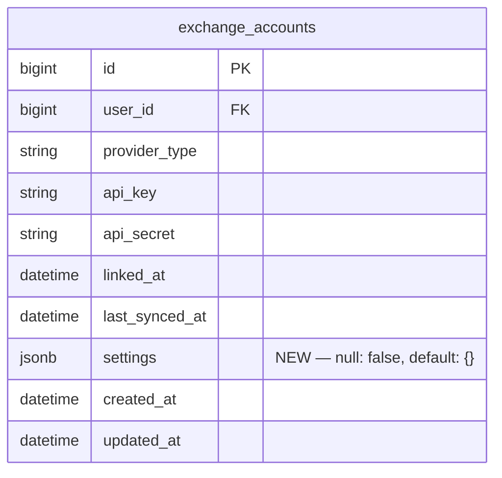

# feat: Add Per-Account Quote Currency Whitelist with USDC Support

## Enhancement Summary

**Deepened on:** 2026-03-19
**Research agents:** kieran-rails-reviewer, dhh-rails-reviewer, data-integrity-guardian, performance-oracle, security-sentinel, code-simplicity-reviewer, architecture-strategist, best-practices-researcher, pattern-recognition-specialist, data-migration-expert

### Key Improvements Over Original Plan

1. **Critical fix — `after_initialize` replaced with reader override:** Writing to `self` in `after_initialize` dirty-tracks the record on every load, causing unnecessary `UPDATE` statements. Use a custom getter instead.
2. **Critical fix — dependency inversion on client constructor default:** `BinanceClient` defaulting to `ExchangeAccount::DEFAULT_QUOTE_CURRENCIES` couples a service to an AR model. Each client defines its own constant.
3. **Architecture clarification — `text[]` vs JSONB debate resolved:** Two reviewers recommended a dedicated `text[]` column for simplicity; the architecture reviewer defended JSONB for extensibility. The brainstorm decision stands (JSONB) but the trade-off is documented with the alternative noted.
4. **Rails `store_accessor` known bugs documented:** Rails issues #50960, #53299 confirm JSONB + `store_accessor` interaction bugs. Mitigation: custom getter + `null: false` migration default.
5. **Shared constant for quote currencies:** `VALID_QUOTE_CURRENCIES` on `ExchangeAccount` must stay in sync with `Binance::TradeNormalizer.normalize_symbol`'s hardcoded list — extract to a shared constant.
6. **Validation cleaned up:** Drop redundant `presence: true` (duplicates `length: { minimum: 1 }`); add explicit `is_array` type validation.
7. **`null: false` on migration:** Required to prevent silent NULLs in the future.
8. **`ProviderForAccount` test gap flagged:** Existing `OpenStruct` account doubles will return `nil` for `allowed_quote_currencies`, silently initializing clients with a nil whitelist.

### New Considerations Discovered

- Rails `store_accessor` returns raw JSONB value with no type casting — an operator writing a string `"USDT"` instead of `["USDT"]` would produce `["U","S","D","T"]` without the Array type guard in `before_validation`
- `symbols_from_income` in `BinanceClient` paginates up to 6 months of records regardless of filtering — the whitelist reduces `userTrades` API calls but not discovery calls
- BingX's three fetch paths (v2_fills, v1_full_order, income) all call `stablequote_pair?` — changing that single method covers all paths, no other changes needed in BingX
- `allowed_quote?` must treat `nil` or empty whitelist as "allow all" (current behavior), not "block all"

---

## Overview

Binance USDC futures trades are not being synced. Fix the discovery bug and add a per-account configurable quote currency whitelist (defaulting to `["USDT", "USDC"]`) stored as a JSONB settings column on `ExchangeAccount`. BingX already supports USDC — its hardcoded constant is replaced by the new account setting.

## Problem Statement

- **Binance (bug):** USDC futures trades are not being synced. The `TradeNormalizer` already handles USDC formatting (`BTCUSDC` → `BTC-USDC`), so the root cause lies in symbol discovery. Two suspect paths: `symbols_from_position_risk` only returns symbols with a non-zero `positionAmt` (closed USDC positions invisible), and `symbols_from_income` caps its lookback at `INCOME_LOOKBACK_MS` (6 months) regardless of `since`. Investigation required.
- **BingX (no bug):** `STABLEQUOTE_SYMBOLS = %w[USDT USDC].freeze` is hardcoded at `bingx_client.rb:13` — USDC already flows through. Needs to be replaced with the account setting for consistency.
- **Gap:** `ExchangeAccount` has no settings column; all exchange clients only receive `api_key:` and `api_secret:` from `ProviderForAccount`.

## Proposed Solution

1. **Migration:** Add `settings jsonb, null: false, default: {}` to `exchange_accounts`.
2. **Model:** Custom getter for `allowed_quote_currencies` that returns the stored value or falls back to `DEFAULT_QUOTE_CURRENCIES` without dirtying the record. Validate as a non-empty Array of known currencies.
3. **Clients:** Both `BinanceClient` and `BingxClient` define their own `DEFAULT_QUOTE_CURRENCIES` constant and accept `allowed_quote_currencies:` as an optional constructor kwarg. An `allowed_quote?` helper filters normalized symbols. `nil` or empty whitelist means "allow all."
4. **ProviderForAccount:** Passes `allowed_quote_currencies: @account.allowed_quote_currencies` to `klass.new(...)`.
5. **Binance fix:** Identify and fix the discovery gap so USDC symbols surface from the income/positionRisk endpoints.

## Technical Considerations

### Schema Change



### Architecture Decision: JSONB `settings` vs Dedicated `text[]` Column

Two reviewers (DHH, simplicity) recommended a dedicated `allowed_quote_currencies text[] default '{USDT,USDC}'` column:

**Arguments for `text[]`:**
- Self-documenting in `schema.rb`
- No `store_accessor` complexity
- DB-level default eliminates nil coercion entirely
- No known Rails bugs

**Arguments for `settings jsonb` (chosen):**
- Extensible — future per-account config (e.g., `sync_lookback_months`, `position_mode`) fits without additional migrations
- Consistent with the codebase's `raw_payload jsonb` pattern on `trades`
- Rails `store_accessor` complexity is manageable with a custom getter

**Decision stands** (see brainstorm). If a second per-account setting never materializes within 6 months, migrate to dedicated columns at that time.

### Model Accessor & Validation

```ruby
# app/models/exchange_account.rb

# Shared with Binance::TradeNormalizer — must stay in sync
SUPPORTED_QUOTE_CURRENCIES = %w[USDT USDC BUSD].freeze
DEFAULT_QUOTE_CURRENCIES = %w[USDT USDC].freeze

store_accessor :settings, :allowed_quote_currencies

# Custom getter — returns stored value or default WITHOUT dirtying the record.
# Do NOT use after_initialize for this: writing self.x = ... in after_initialize
# marks `settings` as changed on every ExchangeAccount.find, causing unnecessary UPDATEs.
def allowed_quote_currencies
  stored = super
  stored.present? ? stored : DEFAULT_QUOTE_CURRENCIES
end

before_validation do
  # Normalize casing on write so "usdt" → "USDT". Guard is required because
  # store_accessor returns raw JSONB — an operator writing "USDT" (string) instead
  # of ["USDT"] (array) would otherwise produce ["U","S","D","T"].
  if settings&.key?("allowed_quote_currencies")
    raw = super_method(:allowed_quote_currencies).call
    if raw.is_a?(Array)
      self.allowed_quote_currencies = raw.map { _1.to_s.strip.upcase }.uniq
    end
  end
end

validate :allowed_quote_currencies_is_array
validates :allowed_quote_currencies,
  length: { minimum: 1, message: "must contain at least one currency" },
  if: -> { allowed_quote_currencies.is_a?(Array) }
validate :allowed_quote_currencies_are_valid

private

def allowed_quote_currencies_is_array
  return if allowed_quote_currencies.nil? || allowed_quote_currencies.is_a?(Array)
  errors.add(:allowed_quote_currencies, "must be an array")
end

def allowed_quote_currencies_are_valid
  return unless allowed_quote_currencies.is_a?(Array)
  invalid = allowed_quote_currencies - SUPPORTED_QUOTE_CURRENCIES
  errors.add(:allowed_quote_currencies, "contains unknown currencies: #{invalid.join(', ')}") if invalid.any?
end
```

> **Rails bug note:** `store_accessor` on JSONB has known issues with defaults (rails/rails #50960, #53299). The custom getter pattern above is the safest mitigation — it never writes to `self` during reads, so dirty tracking is not polluted.

> **`presence: true` omitted intentionally:** `presence: true` and `length: { minimum: 1 }` both reject empty arrays, producing duplicate error messages. Only the `length` validator is needed.

> **`BUSD` in `SUPPORTED_QUOTE_CURRENCIES`:** Included for historical trade compatibility (old BUSD trades already stored). Not in `DEFAULT_QUOTE_CURRENCIES` because Binance deprecated BUSD futures in 2023.

### Shared Quote Currency Constant

`Binance::TradeNormalizer.normalize_symbol` hardcodes `%w[USDT USDC BUSD]` at line 48. This list must match `SUPPORTED_QUOTE_CURRENCIES` on `ExchangeAccount`, or adding a new currency to the model whitelist would allow it through the filter but format the symbol incorrectly (e.g., `BTCFDUSD` instead of `BTC-FDUSD`).

Extract to a shared location:

```ruby
# app/services/exchanges/supported_quote_currencies.rb
module Exchanges
  SUPPORTED_QUOTE_CURRENCIES = %w[USDT USDC BUSD].freeze
end
```

Then reference it from both `ExchangeAccount` and `Binance::TradeNormalizer`:

```ruby
# ExchangeAccount
SUPPORTED_QUOTE_CURRENCIES = Exchanges::SUPPORTED_QUOTE_CURRENCIES
```

```ruby
# Binance::TradeNormalizer#normalize_symbol
Exchanges::SUPPORTED_QUOTE_CURRENCIES.each do |quote|
  # ... existing formatting logic
end
```

### Migration

```ruby
# db/migrate/YYYYMMDDHHMMSS_add_settings_to_exchange_accounts.rb
# frozen_string_literal: true

class AddSettingsToExchangeAccounts < ActiveRecord::Migration[7.2]
  def change
    add_column :exchange_accounts, :settings, :jsonb, null: false, default: {}
  end
end
```

**Migration safety notes:**
- PostgreSQL 11+ stores a constant `{}` default in the catalog without rewriting the table — this is a non-blocking, near-instantaneous operation
- `null: false` prevents silent NULLs from future raw SQL or bugs that write `nil`
- The column default `{}` means existing rows read as `{}` immediately; the custom getter returns `DEFAULT_QUOTE_CURRENCIES` for absent keys
- No data migration step needed for AR-only reads; if raw SQL on `settings` is ever used, a backfill would be required
- `def change` is correct and reversible (Rails inverts to `remove_column`)

### Client Constructor Changes

Each client defines its own constant — no reference to the `ExchangeAccount` model (which would couple a service to AR):

```ruby
# app/services/exchanges/binance_client.rb
DEFAULT_QUOTE_CURRENCIES = %w[USDT USDC].freeze

def initialize(api_key:, api_secret:, base_url: BASE_URL,
               allowed_quote_currencies: DEFAULT_QUOTE_CURRENCIES)
  @allowed_quote_currencies = allowed_quote_currencies || DEFAULT_QUOTE_CURRENCIES
  # ...
end

# Contract: symbol must be in normalized app format (BASE-QUOTE, e.g. "BTC-USDC").
# Do NOT call with raw Binance symbols like "BTCUSDC" — normalize first.
# nil or empty @allowed_quote_currencies means "allow all" to preserve current behavior.
def allowed_quote?(symbol)
  return true if @allowed_quote_currencies.blank?
  return false if symbol.blank?
  quote = symbol.to_s.split("-").last.to_s.upcase
  @allowed_quote_currencies.include?(quote)
end
private :allowed_quote?
```

```ruby
# app/services/exchanges/bingx_client.rb
DEFAULT_QUOTE_CURRENCIES = %w[USDT USDC].freeze

def initialize(api_key:, api_secret:, base_url: BASE_URL,
               allowed_quote_currencies: DEFAULT_QUOTE_CURRENCIES)
  @allowed_quote_currencies = allowed_quote_currencies || DEFAULT_QUOTE_CURRENCIES
  # ...
end
```

> **Backward compatibility:** `ping` class methods call `new(api_key:, api_secret:)` directly, bypassing `ProviderForAccount`. Since the kwarg is optional with a local constant as default, `ping` is unaffected.

> **Nil/empty whitelist = allow all:** This preserves existing behavior for accounts that somehow have a nil or empty value — they keep syncing as before rather than silently dropping all trades.

### BingX — Replace Constant

Remove `STABLEQUOTE_SYMBOLS` constant (line 13). Update `stablequote_pair?` to delegate to `allowed_quote?`. All three fetch paths (`fetch_trades_from_v2_fills`, `fetch_trades_from_v1_full_order`, `fetch_trades_from_income`) already call `stablequote_pair?` — the single method rename covers all three paths.

```ruby
# Before
STABLEQUOTE_SYMBOLS = %w[USDT USDC].freeze

def stablequote_pair?(symbol)
  return false if symbol.blank?
  quote = symbol.to_s.split("-").last.to_s.upcase
  STABLEQUOTE_SYMBOLS.include?(quote)
end

# After — stablequote_pair? becomes an alias for allowed_quote?
# (or inline allowed_quote? directly and remove stablequote_pair?)
alias_method :stablequote_pair?, :allowed_quote?
```

### Binance — Discovery Investigation & Filter

**Step 1 — Investigate** (before writing filter code): Add temporary logging or a test harness to call `symbols_from_position_risk` and `symbols_from_income` for an account with known USDC trades. Confirm whether USDC symbols appear.

**Hypothesis A:** `symbols_from_income` caps lookback at 6 months; old closed USDC positions are beyond this window → fix: extend lookback or widen the `since` parameter.

**Hypothesis B:** `symbols_from_position_risk` only returns open positions; USDC positions are all closed → fix: income endpoint is the only path; ensure lookback covers the relevant period.

**Hypothesis C:** Response parsing issue — raw API response includes USDC symbols but they're dropped somewhere → fix: add logging, inspect raw API response at `signed_get`.

**Step 2 — Filter** (after root cause confirmed): Apply `allowed_quote?` filter in `fetch_my_trades` pre-fetch (before `fetch_user_trades_for_symbol`), reducing unnecessary API calls:

```ruby
# app/services/exchanges/binance_client.rb
def fetch_my_trades(since:)
  symbols = discover_symbols(since_ms: since.to_i * 1000)
  # Filter before fetch_user_trades_for_symbol to avoid unnecessary HTTP calls.
  # Note: discover_symbols (income pagination) still runs unfiltered — the whitelist
  # only prevents userTrades API calls for excluded symbols, not discovery calls.
  symbols.filter_map do |raw_symbol|
    normalized = Binance::TradeNormalizer.normalize_symbol(raw_symbol)
    next unless allowed_quote?(normalized)
    fetch_user_trades_for_symbol(raw_symbol, since_ms: since.to_i * 1000)
  end.flatten
end
```

> **Performance note:** `discover_symbols` paginates up to 6 months of income records regardless of the whitelist. The filter reduces `userTrades` HTTP calls but not discovery calls. This is an acceptable limitation for v1.

### ProviderForAccount

```ruby
# app/services/exchanges/provider_for_account.rb
def client
  klass = REGISTRY.fetch(@account.provider_type)
  klass.new(
    api_key: @account.api_key,
    api_secret: @account.api_secret,
    allowed_quote_currencies: @account.allowed_quote_currencies
  )
end
```

> **Test gap:** Existing `ProviderForAccount` tests use `OpenStruct.new(provider_type: "binance", api_key: "k", api_secret: "s")`. After this change, `allowed_quote_currencies` will return `nil` from `OpenStruct`, initializing clients with `nil`. Since the client constructor does `|| DEFAULT_QUOTE_CURRENCIES`, behavior is safe — but tests should explicitly add `allowed_quote_currencies: %w[USDT USDC]` to be precise.

## System-Wide Impact

- **Interaction graph:** `SyncDispatcherJob` → `SyncExchangeAccountJob` → `SyncService#call` → `ProviderForAccount#client` → `BinanceClient/BingxClient#fetch_my_trades` → `[allowed_quote? filter]` → `SyncService#persist_trade` → `Positions::RebuildForAccountService`. The filter is applied inside `fetch_my_trades`; no changes downstream.
- **Error propagation:** A nil `allowed_quote_currencies` that passes the getter falls back to `DEFAULT_QUOTE_CURRENCIES`. Empty array fails model validation at write time. Both paths prevent "zero trades with no error" silent failures.
- **State lifecycle risks:** Existing trades for a currency removed from the whitelist are NOT deleted — they remain in `trades` and continue in position rebuilds. The whitelist gates what is *fetched*, not what is *stored*. Intentional for v1.
- **API surface parity:** `SUPPORTED_QUOTE_CURRENCIES` on `ExchangeAccount` and `Exchanges::SUPPORTED_QUOTE_CURRENCIES` (shared module) must match `Binance::TradeNormalizer.normalize_symbol`'s quote list. After the shared constant is extracted, this is structurally enforced.
- **Security:** `settings` must never be permitted directly in controller strong params (`permit(:settings)` would open an unlimited key sink). When a UI is added, permit only the virtual accessor: `permit(allowed_quote_currencies: [])`.

## Acceptance Criteria

- [ ] `exchange_accounts` table has a `settings jsonb, null: false, default: {}` column
- [ ] `ExchangeAccount#allowed_quote_currencies` returns `["USDT", "USDC"]` for existing accounts with `settings: {}` — without dirtying the record
- [ ] `ExchangeAccount#allowed_quote_currencies` returns `["USDT", "USDC"]` for new accounts without triggering an extra `UPDATE`
- [ ] `allowed_quote_currencies = []` fails validation with a clear message
- [ ] `allowed_quote_currencies = ["usdt"]` is normalized to `["USDT"]` before save
- [ ] `allowed_quote_currencies = ["BTC"]` fails validation (not in `SUPPORTED_QUOTE_CURRENCIES`)
- [ ] `allowed_quote_currencies = "USDT"` (String, not Array) fails validation with "must be an array"
- [ ] `Exchanges::SUPPORTED_QUOTE_CURRENCIES` module extracted; referenced from both `ExchangeAccount` and `Binance::TradeNormalizer`
- [ ] BingX sync: USDC trades fetched when USDC in whitelist; filtered when not
- [ ] BingX sync: `STABLEQUOTE_SYMBOLS` constant removed; no regression for USDT-only behavior
- [ ] Binance sync: root cause of USDC trade discovery failure identified and documented in a code comment
- [ ] Binance sync: USDC trades appear in `trades` table after sync when USDC is in whitelist
- [ ] Binance sync: symbols not in `allowed_quote_currencies` do not trigger `fetch_user_trades_for_symbol` API calls
- [ ] `allowed_quote?(symbol)` returns `true` when `@allowed_quote_currencies` is nil or empty (allow-all)
- [ ] `ProviderForAccount#client` passes `allowed_quote_currencies` from account to both clients
- [ ] `BinanceClient.new(api_key:, api_secret:)` works without `allowed_quote_currencies:` (uses local constant default)
- [ ] `BingxClient.new(api_key:, api_secret:)` works without `allowed_quote_currencies:` (uses local constant default)
- [ ] Tests: `ExchangeAccountTest` — default getter, normalization, validation (nil, empty, string, unknown currency, valid)
- [ ] Tests: `BingxClientTest` — `stablequote_pair?` with custom whitelist, all three fetch paths filter correctly
- [ ] Tests: `BinanceClientTest` — `fetch_my_trades` with USDC in whitelist, USDC symbols not triggering fetch when excluded
- [ ] Tests: `ProviderForAccountTest` — kwarg threaded correctly with `allowed_quote_currencies`

## Dependencies & Risks

- **Binance investigation first:** The Binance filter implementation depends on confirming the root cause of discovery failure. Do not finalize `BinanceClient` filter placement until confirmed.
- **Shared constant extraction:** `Exchanges::SUPPORTED_QUOTE_CURRENCIES` is a new file — create before updating `ExchangeAccount` and `TradeNormalizer`. Adding a new stablecoin in the future requires only updating this one file.
- **`ping` bypass:** Both clients have a `ping` class method that calls `new(api_key:, api_secret:)` directly. Client-local constant default keeps this path safe — no change needed.
- **Rate limits:** First sync after enabling USDC (max 2/day) may not run immediately. Console setup note: manually enqueue `SyncExchangeAccountJob.perform_later(account.id)` to trigger an immediate sync.
- **Controller mass assignment (future):** Never `permit(:settings)`. Permit only `permitted(allowed_quote_currencies: [])` when a UI is built.
- **Rails `store_accessor` JSONB bugs:** Known bugs in rails/rails #50960 and #53299 affect `store_accessor` + JSONB default interactions. The custom getter pattern mitigates this without requiring the `store_attribute` gem — but consider adding `palkan/store_attribute` if more typed JSONB attributes are added in the future.

## Implementation Order

1. `app/services/exchanges/supported_quote_currencies.rb` — new shared constant module
2. `db/migrate/YYYYMMDDHHMMSS_add_settings_to_exchange_accounts.rb` — migration (`null: false, default: {}`)
3. `app/models/exchange_account.rb` — `store_accessor`, custom getter (not `after_initialize`), `before_validation`, validations; reference `Exchanges::SUPPORTED_QUOTE_CURRENCIES`
4. `app/services/exchanges/binance/trade_normalizer.rb` — update `normalize_symbol` to reference `Exchanges::SUPPORTED_QUOTE_CURRENCIES`
5. `test/models/exchange_account_test.rb` — model validation tests (currently empty, needs full coverage)
6. **Binance investigation** — confirm discovery root cause (add logging, inspect API response, document in comment)
7. `app/services/exchanges/binance_client.rb` — local `DEFAULT_QUOTE_CURRENCIES` constant + `allowed_quote_currencies:` kwarg + `allowed_quote?` + filter in `fetch_my_trades` + discovery fix
8. `app/services/exchanges/bingx_client.rb` — local `DEFAULT_QUOTE_CURRENCIES` constant + `allowed_quote_currencies:` kwarg + replace `STABLEQUOTE_SYMBOLS` reference
9. `app/services/exchanges/provider_for_account.rb` — pass kwarg in `client` method; update test fixtures
10. `test/services/exchanges/binance_client_test.rb` — update + add tests
11. `test/services/exchanges/bingx_client_test.rb` — update + add tests
12. `test/services/exchanges/provider_for_account_test.rb` — add `allowed_quote_currencies:` to OpenStruct doubles

## Sources & References

### Origin

- **Brainstorm document:** [docs/brainstorms/2026-03-19-usdc-pair-support-brainstorm.md](../brainstorms/2026-03-19-usdc-pair-support-brainstorm.md)
  Key decisions carried forward: (1) JSONB settings column on ExchangeAccount over UserPreference, (2) per-account scope over global, (3) quote-currency granularity over full pair symbols.

### Internal References

- BingX filter: `app/services/exchanges/bingx_client.rb:13` (STABLEQUOTE_SYMBOLS), `:94` (stablequote_pair?)
- Binance discovery: `app/services/exchanges/binance_client.rb:85` (symbols_from_position_risk), `:98` (symbols_from_income)
- Binance normalizer: `app/services/exchanges/binance/trade_normalizer.rb:43` (normalize_symbol, hardcoded quote list → will reference shared constant)
- Client instantiation: `app/services/exchanges/provider_for_account.rb:25` (client method)
- Existing JSONB pattern: `db/migrate/20260226152156_create_trades.rb` (`raw_payload jsonb, default: {}`)
- BingX test patterns: `test/services/exchanges/bingx_client_test.rb`
- Binance test patterns: `test/services/exchanges/binance_client_test.rb`

### External References

- Rails `store_accessor` + JSONB known bugs: [rails/rails #50960](https://github.com/rails/rails/issues/50960), [rails/rails #53299](https://github.com/rails/rails/issues/53299)
- Rails `store_accessor` dirty tracking design: [rails/rails #34537](https://github.com/rails/rails/issues/34537)
- Typed store accessors (future consideration if more JSONB attrs added): [palkan/store_attribute](https://github.com/palkan/store_attribute)
- PostgreSQL 11+ non-blocking `ADD COLUMN DEFAULT`: [brandur.org/postgres-default](https://brandur.org/postgres-default)
