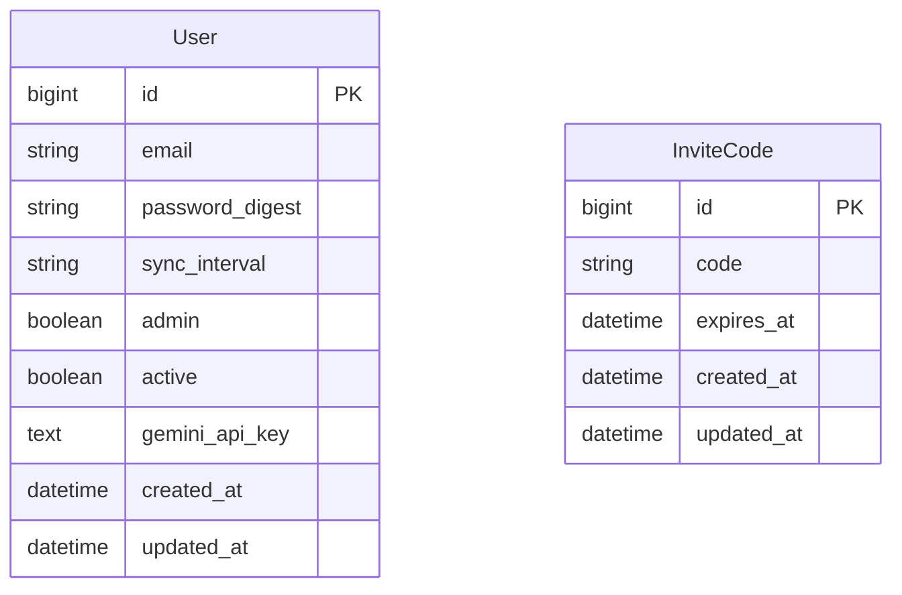

# feat: Institute Multi-User Platform

---
title: Institute Multi-User Platform
type: feat
status: active
date: 2026-04-08
origin: docs/brainstorms/2026-04-08-institute-multi-user-brainstorm.md
deepened: 2026-04-08
---

## Enhancement Summary

**Deepened on:** 2026-04-08
**Agents used:** Kieran Rails Reviewer, DHH Rails Reviewer, Performance Oracle, Data Migration Expert, Data Integrity Guardian, Code Simplicity Reviewer

### Key Improvements Added

1. **`rotate!` order reversed** — create new code first, then delete old, eliminating the zero-codes race window
2. **`avg_realized_pl` denominator bug fixed** — was dividing by students-with-positions, must divide by all students
3. **`set_student` scope corrected** — `before_action :set_student` must have `only:` or it crashes on `index`
4. **`require_admin` missing `and return`** — without it the action body executes after redirect
5. **`Admin::StudentsController#index` `.send` removed** — calling a private method via `send` is wrong; `realized_pl_by_user` made public
6. **Student queries consolidated** — `StudentSummaryService` three-position queries collapsed into one `GROUP BY open` query
7. **`current_user` scoped through `active`** — inactive check cannot be bypassed by any controller that skips `require_login`
8. **Admin self-deactivation guard** — `before_update` callback prevents deactivating the last active admin
9. **`SummaryStatRowComponent` typed slots removed** — `renders_many :stats, StatCardComponent` is over-componentized; use `content` yield instead
10. **`Data.define` removed from services** — single call site services don't need value objects; direct instance variable assignment

### New Considerations Discovered

- `Time.zone.parse(nil)` returns `nil` not `ArgumentError` — the rescue in `InviteCodesController` would never fire on blank input
- Email case normalization gap — `.to_s.downcase` only in `SessionsController` but not saved on `User` at registration
- `invite_codes` needs a DB-level single-row constraint (functional unique index) to enforce business rule at DB level
- `expires_at` future-date validation must use `-> { Time.current }` lambda (not a static value) to be evaluated at validation time
- `Admin::InviteCodesController` vs `resource :invite_code` naming — singular resource → singular controller name

---

## Overview

Transform the personal investment tracker into a multi-user educational platform for a financial institute. Students register with a rotating invite code and get the full existing experience in isolation. An admin role gains a dedicated `/admin` namespace with a class-wide dashboard, aggregated statistics, and read-only drill-down into any student's portfolio.

Delivered in three phases: (1) extract molecule ViewComponents and refactor existing views, (2) multi-user foundation (invite codes, active flag), (3) admin namespace.

See brainstorm: `docs/brainstorms/2026-04-08-institute-multi-user-brainstorm.md`

---

## Key Decisions Carried Forward from Brainstorm

- **Single institute** — no multi-tenancy between organizations
- **Approach B** — dedicated `/admin` namespace, not context-switching within student controllers
- **ViewComponent refactor first** — existing views refactored before admin views are built
- **Invite code** — rotating DB record with `expires_at`, multi-use (whole class shares one code)
- **Admin visibility** — full read-only on student data; admin CAN write `active` flag and rotate invite codes; admin CANNOT mutate student trade/portfolio data
- **Aggregation** — on-the-fly SQL, no caching; realized P&L only; `GROUP BY user_id` on `positions.net_pl`
- **`active` flag** — manually toggled by admin; defaults to `true` on registration
- **No `Data.define` result objects** — services set instance variables directly; no value-object wrapper needed at this scale

---

## SpecFlow Gap Resolutions

| Gap | Resolution |
|---|---|
| First admin bootstrap | `db/seeds.rb` creates one admin user via `User.find_or_create_by!(email: ENV["ADMIN_EMAIL"])` — requires `ADMIN_EMAIL` + `ADMIN_PASSWORD` env vars |
| Single-use vs multi-use invite code | Multi-use — whole class shares one rotating code |
| `active: false` login behavior | Generic error "Invalid email or password" (no enumeration); checked in `SessionsController#create` |
| Active session after deactivation | `current_user` scoped through `User.where(active: true)` — inactive users resolve to `nil` immediately |
| Admin write scope | Admin CAN: toggle `active`, rotate invite codes. Admin CANNOT: create/edit/delete any student data |
| `Dashboards::SummaryService` find-or-create risk | Admin student views use a new `Admin::StudentSummaryService` that only reads — never reuses services with `find_or_create_*` |
| `REGISTRATION_OPEN` env var | Removed entirely — replaced by invite code logic |
| `CardSectionComponent` vs `CardComponent` | No new component — `CardComponent` already has `heading:` + renders as `<section>`. Use it consistently with `card-accent` class passthrough |
| Admin layout | Separate `app/views/layouts/admin.html.erb` — no AI chat panel, dedicated admin nav |
| Invite code expiry | Admin sets `expires_at` as a datetime at rotation time — no hardcoded default |
| Leaderboard visibility | Admin only; students have no leaderboard or rank visibility |

---

## Schema Changes



**New columns/tables:**
- `users.active` — `boolean, default: true, null: false`
- `invite_codes` — new table: `code string not null`, `expires_at datetime not null`; unique index on `code`; functional unique index enforcing single-row business rule

---

## Phase 1: View Component Molecules + View Refactor

### 1.1 `SummaryStatRowComponent` (new)

**What:** The `<div class="mb-6 flex flex-wrap items-baseline gap-6">` container that groups `StatCardComponent` instances. Currently hardcoded in 10+ places across dashboard, stocks, spot, and allocations.

**API:**
```ruby
# app/components/summary_stat_row_component.rb
# Uses content yield — NOT renders_many typed slots
# mb: (integer, default 6) → "mb-#{mb}"
```

**Template:**
```erb
<div class="<%= row_css %>">
  <%= content %>
</div>
```

**Usage:**
```erb
<%= render SummaryStatRowComponent.new(mb: 6) do %>
  <%= render StatCardComponent.new(label: "P&L", value: format_money(@pl), signed: true, color_value: @pl) %>
  <%= render StatCardComponent.new(label: "ROI", value: "#{@roi}%") %>
<% end %>
```

> **Research insight (Code Simplicity + Pattern):** `renders_many :stats, StatCardComponent` was proposed originally but rejected. Typed slots are for when the parent component needs to know about, enumerate, or wrap each child individually. A stat row just wraps a div — `content` yield is the right pattern. This matches the established codebase convention (use typed slots for `DataTableComponent` rows because the table needs to iterate them; use `content` for pure layout containers). This also keeps callers free to mix in non-StatCard children in future admin contexts without API changes.

**Files to refactor:** `dashboards/show.html.erb` (6 stat rows), `stocks/index.html.erb` (2), `spot/index.html.erb` (1), `allocations/show.html.erb` (1).

---

### 1.2 `PageHeaderComponent` (new)

**What:** The `<h1 class="text-2xl font-semibold text-slate-900">` + optional subtitle + optional right-side actions pattern. Appears once per page in all 5 main views and will be needed in all admin views.

**API:**
```ruby
# app/components/page_header_component.rb
# title: String (required)
# subtitle: String (optional)
renders_one :actions  # arbitrary HTML block, rendered right-aligned
```

**Template:**
```erb
<div class="<%= wrapper_css %>">
  <div>
    <h1 class="text-2xl font-semibold text-slate-900"><%= @title %></h1>
    <% if @subtitle %>
      <p class="mt-1 text-sm text-slate-500"><%= @subtitle %></p>
    <% end %>
  </div>
  <% if actions %>
    <div class="flex items-center gap-3"><%= actions %></div>
  <% end %>
</div>
```

`wrapper_css` method (resolved in Ruby per convention): `"mb-6 flex items-start justify-between"` when `actions` present, `"mb-6"` otherwise.

> **Research insight (Pattern):** `renders_one :actions` is the correct slot API here — a single optional block of arbitrary HTML (links, buttons) that varies per page. `content_for` is an alternative but slots are preferable when the component itself controls layout (here the component positions actions right-aligned). The `wrapper_css` being computed in Ruby (not the template) is consistent with the established codebase convention of resolving all style logic in the component class.

**Files to refactor:** all 5 main views.

---

### 1.3 `DateRangeFilterComponent` — enhance with extra fields slot

**What:** Component already exists. The trades view needs an Exchange Account dropdown alongside the date range. Add a `with_extra_fields` slot for arbitrary visible filter fields.

**API addition:**
```ruby
renders_one :extra_fields  # yields into the flex gap row between To date and Clear link
```

> **Research insight (Rails Reviewer):** The existing `extra_params:` hash on `DateRangeFilterComponent` handles hidden fields. The new `extra_fields` slot is for visible fields (selects, text inputs). These are distinct concerns — keep both. Document in the component which to use for which purpose. Ensure existing callsites that pass `extra_params:` are not broken (they don't use the slot, so no migration needed).

**Files to refactor:** `trades/index.html.erb` (×2 — history + exchange views), `spot/index.html.erb`.

---

### 1.4 `CardComponent` consistent usage

**What:** No new component. `CardComponent` already accepts `heading:`, `margin:`, and `**html_options` including class. Dashboard and allocations have 10+ inline `<section class="card-accent rounded-lg...">` patterns not using `CardComponent`.

**Action:** Audit all inline card sections in `dashboards/show.html.erb` and `allocations/show.html.erb` and replace with:
```erb
<%= render CardComponent.new(heading: "...", class: "card-accent mb-8", data: { controller: "..." }) do %>
  ...
<% end %>
```

---

### 1.5 View Refactor Mapping

| View | Changes |
|---|---|
| `dashboards/show.html.erb` | `PageHeaderComponent`, `SummaryStatRowComponent` (×6), `CardComponent` consistent (×6) |
| `trades/index.html.erb` | `PageHeaderComponent`, `DateRangeFilterComponent` with `extra_fields` slot (×2) |
| `stocks/index.html.erb` | `PageHeaderComponent` with actions slot, `SummaryStatRowComponent` (×2) |
| `spot/index.html.erb` | `PageHeaderComponent`, `SummaryStatRowComponent`, `DateRangeFilterComponent` with `extra_fields` slot |
| `allocations/show.html.erb` | `PageHeaderComponent`, `SummaryStatRowComponent`, `CardComponent` consistent (×4) |

---

### Phase 1 Acceptance Criteria

- [ ] `SummaryStatRowComponent` uses `content` yield (not `renders_many`) and renders identical HTML to current inline divs
- [ ] `PageHeaderComponent` renders correctly with and without subtitle and actions slot
- [ ] `DateRangeFilterComponent` extra_fields slot renders additional filter fields inside the flex row; existing `extra_params:` callers unaffected
- [ ] `CardComponent` replaces all inline `card-accent` section patterns in dashboard and allocations
- [ ] All 5 main views pass existing controller tests (no regressions)
- [ ] No inline `flex flex-wrap items-baseline gap-6` stat containers remain outside components
- [ ] No inline `card-accent rounded-lg border border-slate-200` section patterns remain outside `CardComponent`
- [ ] No inline `text-2xl font-semibold text-slate-900` h1 patterns remain outside `PageHeaderComponent`

---

## Phase 2: Multi-User Foundation

### 2.1 Database migrations

**Migration 1 — Add `active` to users:**
```ruby
# db/migrate/TIMESTAMP_add_active_to_users.rb
def change
  add_column :users, :active, :boolean, default: true, null: false
end
```

> **Research insight (Data Migration Expert):** On PostgreSQL 11+, `ADD COLUMN` with a `NOT NULL DEFAULT` is a metadata-only operation — no row rewrite, no table lock. All existing users get `active = true` via the catalog default. This migration is safe to run live at any scale.

**Migration 2 — Create `invite_codes`:**
```ruby
# db/migrate/TIMESTAMP_create_invite_codes.rb
def change
  create_table :invite_codes do |t|
    t.string :code, null: false, limit: 64
    t.datetime :expires_at, null: false, precision: 6
    t.timestamps
  end

  add_index :invite_codes, :code, unique: true
  add_index :invite_codes, :expires_at

  # Enforce single-row business rule at DB level
  # A functional unique index on a constant prevents any second row from being inserted
  add_index :invite_codes, "(true)", unique: true, name: "index_invite_codes_singleton"
end
```

> **Research insights (Data Migration Expert + Data Integrity Guardian):**
> - `limit: 64` on `code` prevents empty strings and oversized values at the DB level. Add a `check_constraint` if Rails version supports it: `check_constraint "char_length(code) >= 8"`.
> - `precision: 6` on `expires_at` for microsecond precision consistency with Rails 7.2 defaults.
> - `add_index :invite_codes, :expires_at` — needed for any query sweeping expired codes.
> - The functional unique index `(true)` is a PostgreSQL pattern that enforces at most one row in the table. Any second insert raises a `PG::UniqueViolation` regardless of code value. This makes the "only one invite code" business rule unbypassable by raw SQL or migrations.

---

### 2.2 `InviteCode` model

```ruby
# app/models/invite_code.rb
# frozen_string_literal: true

class InviteCode < ApplicationRecord
  validates :code, presence: true, uniqueness: true
  validates :expires_at, presence: true,
                         comparison: { greater_than: -> { Time.current }, on: :create }

  def self.current
    where("expires_at > ?", Time.current).order(created_at: :desc).first
  end

  def self.rotate!(expires_at:)
    transaction do
      new_code = create!(code: SecureRandom.hex(16), expires_at: expires_at)
      where.not(id: new_code.id).delete_all
      new_code
    end
  end

  def valid_for_registration?
    expires_at.present? && expires_at > Time.current
  end
end
```

> **Research insights (Rails Reviewer + Data Integrity Guardian):**
> - **`rotate!` order reversed** (critical fix): `create!` first, then `delete_all` of old rows. The original `delete_all` → `create!` order had a window where `InviteCode.current` returns `nil`, rejecting legitimate registration attempts mid-transaction. The new order ensures at least one valid code always exists. If `create!` fails validation, the transaction rolls back and the old code is preserved.
> - **`current` now filters by validity**: `where("expires_at > ?", Time.current)` ensures `current` returns a usable code, not just the most recently created one. The old implementation could return an expired code if it was created after a valid one.
> - **`valid_for_registration?` nil guard**: `expires_at.present? &&` prevents `NoMethodError` on records built in tests without an expiry.
> - **`expires_at` future-date validator**: `-> { Time.current }` is a lambda so it is evaluated at validation time (not at class load time). `on: :create` prevents the validator from firing on existing records during updates.
> - **`delete_all` vs `destroy_all`**: `delete_all` is intentional here since `InviteCode` has no associations or callbacks to invoke. If those are ever added, revisit this.

---

### 2.3 `ApplicationController` — active check via `current_user` scope

```ruby
# app/controllers/application_controller.rb

def current_user
  @current_user ||= User.where(active: true).find_by(id: session[:user_id]) if session[:user_id]
end

def require_login
  unless current_user
    redirect_to login_path, alert: "Please sign in." and return
  end
end
```

> **Research insight (Data Integrity Guardian + Rails Reviewer):** Scoping `current_user` through `User.where(active: true)` means an inactive user resolves to `nil` regardless of which controller method calls `current_user`. This is safer than a `before_action` check because controllers that `skip_before_action :require_login` (like `SessionsController` and `UsersController`) would bypass a callback-based check — but they still call `current_user`, which now naturally returns `nil` for inactive users. The `require_login` callback is simplified: it only checks for nil. Separation of concerns is clean.
>
> Note: `reset_session` is removed from `require_login`. Resetting the session when a user is simply not logged in is unnecessary. The session is already reset on logout and on login (session fixation protection). If a previously-active user is deactivated, their session key still exists but `current_user` returns `nil` — they are effectively signed out on the next request without an explicit reset.

---

### 2.4 `SessionsController` — active check on login

```ruby
# app/controllers/sessions_controller.rb — create action
def create
  user = User.find_by(email: params[:email].to_s.strip.downcase)
  if user&.authenticate(params[:password]) && user.active?
    reset_session
    session[:user_id] = user.id
    redirect_to root_path
  else
    flash.now[:alert] = "Invalid email or password."
    render :new, status: :unprocessable_entity
  end
end
```

> **Research insight (Rails Reviewer):** `.strip.downcase` on the email input guards against leading/trailing whitespace in addition to case normalization. Add a corresponding `before_validation` on `User` to normalize email on save: `before_validation { self.email = email.to_s.strip.downcase }` — otherwise a user who registers with `User@Example.com` cannot log in with `user@example.com`. The `active?` check merged with `&&` preserves the generic error message for both authentication failures and inactive accounts (no account enumeration).

---

### 2.5 `User` model additions

```ruby
# app/models/user.rb additions

before_validation { self.email = email.to_s.strip.downcase }

validates :active, inclusion: { in: [true, false] }

scope :active, -> { where(active: true) }

before_update :prevent_last_admin_deactivation

private

def prevent_last_admin_deactivation
  return unless admin? && will_save_change_to_active?(to: false)
  remaining = User.where(admin: true, active: true).where.not(id: id).count
  errors.add(:active, "cannot deactivate the last active admin")
  throw :abort if remaining.zero?
end
```

> **Research insight (Data Integrity Guardian):** The `prevent_last_admin_deactivation` callback ensures there is always at least one active admin, preventing lockout. Uses `will_save_change_to_active?` (Rails dirty tracking) so it only fires when `active` is actually being changed to `false` on an admin account. `throw :abort` prevents the save and the `errors.add` surfaces the message to the UI.

---

### 2.6 `UsersController` — invite code registration

**Remove** `ENV["REGISTRATION_OPEN"]` gate entirely. Replace with invite code validation.

```ruby
# app/controllers/users_controller.rb
def create
  @user = User.new(user_params)
  invite = InviteCode.current

  unless invite&.valid_for_registration? && ActiveSupport::SecurityUtils.secure_compare(
    params[:invite_code].to_s, invite.code
  )
    flash.now[:alert] = "Invalid or expired invite code."
    render :new, status: :unprocessable_entity and return
  end

  if @user.save
    reset_session
    session[:user_id] = @user.id
    redirect_to root_path
  else
    render :new, status: :unprocessable_entity
  end
end
```

> **Research insights (Rails Reviewer + Security):**
> - **`@user` assigned once before the invite check** — the original plan called `User.new(user_params)` twice. One assignment at the top keeps the form re-populated on all error paths.
> - **`ActiveSupport::SecurityUtils.secure_compare`** — constant-time string comparison prevents timing attacks. A naive `==` comparison leaks information about how many characters match via timing differences. `secure_compare` is built into Rails and is the correct tool for any secret comparison. Note: both arguments are padded to equal length internally; pass `.to_s` to avoid nil errors.
> - **`invite_code` not in `user_params`** — validated and consumed before `User.new`, never persisted.

Add `invite_code` field to `app/views/users/new.html.erb` using `FormFieldComponent`.

---

### 2.7 Seeds — first admin user

```ruby
# db/seeds.rb
# frozen_string_literal: true

if User.where(admin: true).none?
  User.create!(
    email: ENV.fetch("ADMIN_EMAIL") { raise "Set ADMIN_EMAIL env var before seeding" },
    password: ENV.fetch("ADMIN_PASSWORD") { raise "Set ADMIN_PASSWORD env var before seeding" },
    password_confirmation: ENV.fetch("ADMIN_PASSWORD"),
    admin: true,
    active: true
  )
  puts "Admin user created: #{ENV["ADMIN_EMAIL"]}"
end
```

> **Research insight (Rails Reviewer):** Block form of `ENV.fetch` with a `raise` produces a human-readable error message instead of the default `KeyError: key not found: "ADMIN_EMAIL"`.

---

### Phase 2 Acceptance Criteria

- [ ] A student can register with a valid, non-expired invite code
- [ ] Registration is rejected with "Invalid or expired invite code" when code is wrong or expired
- [ ] `active: false` users cannot log in (generic error shown — no account enumeration)
- [ ] `active: false` users are returned `nil` from `current_user` on any subsequent request
- [ ] Admin user can be created via `bin/rails db:seed` with env vars
- [ ] `InviteCode.rotate!` creates new code first, then deletes old atomically — no zero-code window
- [ ] `InviteCode.current` returns only non-expired codes
- [ ] DB functional unique index prevents more than one `invite_codes` row
- [ ] Old `REGISTRATION_OPEN` env var check is completely removed
- [ ] `secure_compare` used for invite code comparison (timing attack protection)
- [ ] `users_controller_test.rb` updated to test invite code flow
- [ ] Admin cannot deactivate themselves if they are the last active admin
- [ ] Email is normalized (lowercased + stripped) on User save

---

## Phase 3: Admin Namespace

### 3.1 Routes

```ruby
# config/routes.rb
namespace :admin do
  root "dashboard#show"
  resources :students, only: %i[index show] do
    member { patch :toggle_active }
  end
  resource :invite_code, only: %i[show create]
end
```

> **Research insight (Rails Reviewer):** `resource :invite_code` (singular) is correct — one code at a time. The controller must be named `Admin::InviteCodeController` (singular), not `InviteCodesController`, to match Rails' singular resource routing convention.

---

### 3.2 `Admin::BaseController`

```ruby
# app/controllers/admin/base_controller.rb
# frozen_string_literal: true

class Admin::BaseController < ApplicationController
  layout "admin"
  before_action :require_admin

  private

  def require_admin
    redirect_to root_path, alert: "Not authorized." and return unless current_user&.admin?
  end
end
```

> **Research insight (Rails Reviewer):** `and return` after the redirect is critical. Without it, the action body executes after `redirect_to` is queued, which causes double-render errors or unexpected database mutations in the action. The pattern `redirect_to ... and return` is the idiomatic Rails guard clause for `before_action` methods.

---

### 3.3 `app/views/layouts/admin.html.erb`

Separate layout — no AI chat panel. Includes:
- Admin-specific navbar with links: Dashboard · Students · Invite Code
- "Back to my portfolio" link to `root_path`
- No Stimulus `money-visibility` toggle (admin views don't show personal money)
- `flash` messages rendered via the shared partial

---

### 3.4 `Admin::DashboardController`

```ruby
# app/controllers/admin/dashboard_controller.rb
# frozen_string_literal: true

class Admin::DashboardController < Admin::BaseController
  def show
    students = User.where(admin: false)
    @total_students   = students.count
    @active_students  = students.where(active: true).count
    @pl_by_user       = Admin::StudentStats.realized_pl_by_user
    @profitable_count = @pl_by_user.count { |_, pl| pl > 0 }
    @profitable_pct   = @total_students > 0 ? (@profitable_count.to_f / @total_students * 100).round(1) : 0
    @total_realized   = @pl_by_user.values.sum
    @avg_realized     = @total_students > 0 ? @total_realized / @total_students : 0
    @leaderboard      = Admin::StudentStats.leaderboard(@pl_by_user)
  end
end
```

> **Research insight (DHH Rails Reviewer + Code Simplicity):** The original `Admin::ClassStatsService` with `Data.define` was over-engineered for a single call site. Query logic belongs on the model layer as scopes/class methods, not wrapped in a service value object. Instance variables set directly in the controller are readable and testable without an extra indirection layer. The stat helpers are extracted to `Admin::StudentStats` (a plain module of class methods) rather than a service object — this keeps query logic out of the controller while avoiding the `Data.define` ceremony.
>
> **`avg_realized_pl` denominator bug fixed:** The original plan divided by `[pl_by_user.size, 1].max` — the count of students who have at least one closed position. This excluded students with no trades from the average, skewing it upward. The correct denominator is `@total_students` (all non-admin users), treating zero-trade students as 0.0 P&L.

---

### 3.5 `Admin::StudentStats` module

```ruby
# app/models/admin/student_stats.rb
# frozen_string_literal: true

module Admin::StudentStats
  # Returns { user_id (int) => realized_pl (float) } for all non-admin students
  # Students with no closed positions are absent from the hash (treat as 0.0 at call site)
  def self.realized_pl_by_user
    Position
      .joins(exchange_account: :user)
      .where(open: false)
      .where(users: { admin: false })
      .group("users.id")
      .sum(:net_pl)
      .transform_values(&:to_f)
  end

  # Returns array of { user_id:, email:, realized_pl: } sorted by descending P&L
  # Uses pluck to avoid loading full User objects into memory
  def self.leaderboard(pl_by_user)
    User.where(admin: false)
        .pluck(:id, :email)
        .map { |id, email| { user_id: id, email: email, realized_pl: pl_by_user.fetch(id, 0.0) } }
        .sort_by { |r| -r[:realized_pl] }
  end
end
```

> **Research insight (Performance Oracle):** The original `build_leaderboard` called `students.map` on an AR relation, loading full User objects (including `password_digest` and encrypted `gemini_api_key`) into memory. `pluck(:id, :email)` fetches only the two needed columns. At 200+ students the difference in memory pressure is significant. The `pl_by_user` hash keyed by integer `user_id` pairs correctly with `pluck` result integers.
>
> One SQL query (aggregation) + one SQL query (pluck) = 2 queries total for the leaderboard. No N+1.

---

### 3.6 `Admin::StudentsController`

```ruby
# app/controllers/admin/students_controller.rb
# frozen_string_literal: true

class Admin::StudentsController < Admin::BaseController
  before_action :set_student, only: %i[show toggle_active]

  def index
    @students   = User.where(admin: false).order(:email).pluck(:id, :email, :active)
    @pl_by_user = Admin::StudentStats.realized_pl_by_user
  end

  def show
    @realized_pl           = Admin::StudentStats.realized_pl_by_user[@student.id].to_f
    @position_counts       = Admin::StudentStats.position_counts_for(@student)
    @recent_positions      = Position.for_student(@student).where(open: false)
                                     .order(close_at: :desc).limit(10)
                                     .includes(:exchange_account)
    @stock_portfolios      = @student.stock_portfolios.includes(:stock_trades)
    @spot_accounts         = @student.spot_accounts.includes(:spot_transactions)
  end

  def toggle_active
    if @student.update(active: !@student.active)
      redirect_to admin_students_path,
                  notice: "#{@student.email} marked #{@student.active? ? "active" : "inactive"}."
    else
      redirect_to admin_students_path,
                  alert: @student.errors.full_messages.to_sentence
    end
  end

  private

  def set_student
    @student = User.where(admin: false).find(params[:id])
  end
end
```

> **Research insights (Rails Reviewer + Performance Oracle):**
> - **`before_action :set_student, only: %i[show toggle_active]`** (critical fix): without `only:`, `set_student` runs for `index` where `params[:id]` is absent, raising `ActionController::ParameterMissing` or a `RecordNotFound`.
> - **`index` uses `pluck` not `where`**: loads only `id, email, active` — not full User objects with encrypted keys.
> - **`toggle_active` uses `update` not `update!`**: the `prevent_last_admin_deactivation` callback may add errors and `throw :abort`. Using `update!` would raise instead of gracefully redirecting with the error message.
> - **`set_student` scopes to `admin: false`**: prevents an admin from viewing or toggling another admin account via the students endpoint.
> - **`.includes(:exchange_account)` on `recent_positions`**: prevents N+1 if the view accesses `position.exchange_account`.

---

### 3.7 `Admin::StudentStats` additions for show page

```ruby
# Add to app/models/admin/student_stats.rb

def self.position_counts_for(user)
  Position.for_student(user)
          .group(:open)
          .count
  # Returns { true => N, false => M } — one query for both open and closed counts
end
```

Add scope to `Position` model:
```ruby
# app/models/position.rb
scope :for_student, ->(user) {
  joins(:exchange_account).where(exchange_accounts: { user_id: user.id })
}
```

> **Research insight (Performance Oracle):** The original `StudentSummaryService` fired three separate queries against the positions table: `sum(:net_pl)`, `where(open: true).count`, `where(open: false).count`. These all hit the same table with the same join. `GROUP BY open` collapses them into one query that returns `{ true => open_count, false => closed_count }`. The `sum` is kept separate (in `realized_pl_by_user`) because it also serves the dashboard aggregation — avoid running it twice by passing the cached value from the outer caller.

---

### 3.8 `Admin::InviteCodeController` (singular)

```ruby
# app/controllers/admin/invite_code_controller.rb
# frozen_string_literal: true

class Admin::InviteCodeController < Admin::BaseController
  def show
    @invite_code = InviteCode.current
  end

  def create
    expires_at = Time.zone.parse(params[:expires_at].to_s.presence || "")
    if expires_at.nil? || expires_at <= Time.current
      redirect_to admin_invite_code_path, alert: "Please provide a valid future expiry date."
      return
    end

    InviteCode.rotate!(expires_at: expires_at)
    redirect_to admin_invite_code_path, notice: "Invite code rotated."
  rescue ActiveRecord::RecordInvalid => e
    redirect_to admin_invite_code_path, alert: "Could not rotate code: #{e.message}"
  end
end
```

> **Research insight (Rails Reviewer):** `Time.zone.parse(nil)` returns `nil`, not `ArgumentError` — the original `rescue ArgumentError` would never fire on blank input, silently passing a nil `expires_at` to `rotate!` which would then fail at the model validation level without surfacing the error to the user. The corrected version validates the parsed datetime explicitly before calling `rotate!`. Rescues `ActiveRecord::RecordInvalid` (from `create!`) for edge cases.

---

### 3.9 Admin Views

All admin views use:
- `PageHeaderComponent` for page titles
- `SummaryStatRowComponent` for class-wide stats
- `CardComponent` for section wrappers
- `DataTableComponent` for student list
- `BadgeComponent` for active/inactive status

**`admin/dashboard/show.html.erb`** — class overview:
- `PageHeaderComponent` title: "Class Overview"
- `SummaryStatRowComponent`: Total Students, Active Students, % Profitable, Total Realized P&L, Avg Realized P&L
- `CardComponent` heading: "Leaderboard" — `DataTableComponent` with columns: Student (email), Realized P&L, Status badge

**`admin/students/index.html.erb`** — student list:
- `PageHeaderComponent` title: "Students"
- `DataTableComponent`: Email, Realized P&L, Status (badge), Actions (toggle active button + view link)
- Note: view is built from `@students` (pluck array) and `@pl_by_user` hash — no AR objects on this page

**`admin/students/show.html.erb`** — per-student detail (read-only):
- `PageHeaderComponent` title: student email, subtitle: "Read-only view"
- `SummaryStatRowComponent`: Realized P&L, Open Positions, Closed Positions
- `CardComponent` heading: "Recent Closed Positions" — `DataTableComponent` with position rows (no API keys rendered)
- `CardComponent` heading: "Stock Portfolios" — list with trade count per portfolio
- `CardComponent` heading: "Spot Accounts" — list with transaction count per account
- **No exchange account API keys, no Gemini API key rendered anywhere**

**`admin/invite_code/show.html.erb`** — invite code management:
- `PageHeaderComponent` title: "Invite Code"
- `CardComponent`: current code displayed in full (copy-friendly `<code>` element), expiry date
- Rotate form: datetime field for new expiry + submit button

---

### Phase 3 Acceptance Criteria

- [ ] Non-admin users hitting any `/admin/*` route are redirected to root with "Not authorized"
- [ ] Admin dashboard shows correct % profitable (over all students, not just those with trades), total P&L, avg P&L, total/active student counts
- [ ] Student leaderboard is sorted by descending realized P&L; students with no trades appear at bottom with 0.0
- [ ] Students index lists all non-admin users with their realized P&L and active status badge
- [ ] Students index is built from `pluck` — no full User AR objects with encrypted fields
- [ ] Admin can toggle a student's `active` flag from the students index
- [ ] Last active admin cannot be deactivated (error shown)
- [ ] `toggle_active` uses `before_action :set_student, only:` — does not run on index
- [ ] Per-student show page: one query for position counts (GROUP BY open), not three
- [ ] Per-student show page does NOT display API keys (exchange account or Gemini)
- [ ] Admin invite code page shows current code and expiry
- [ ] Admin can rotate the invite code by submitting a valid future expiry datetime
- [ ] Blank or past expiry date shows error, does not crash
- [ ] After rotation, new code is valid; old code is gone
- [ ] Admin views use the `admin` layout (no AI chat panel)
- [ ] Controller file is `admin/invite_code_controller.rb` (singular) matching `resource :invite_code` route
- [ ] Admin namespace tests cover: require_admin redirect, dashboard stat accuracy, students index pluck shape, toggle_active with last-admin guard, invite code rotation and blank-date rejection

---

## System-Wide Impact

### Interaction Graph

```
POST /users (registration)
  └─ InviteCode.current (WHERE expires_at > NOW() ORDER BY created_at DESC LIMIT 1)
  └─ secure_compare(params[:invite_code], invite.code)
  └─ User.new + User.save
  └─ reset_session + session[:user_id]

Any authenticated request
  └─ current_user → User.where(active: true).find_by(id: session[:user_id])
  └─ Returns nil if inactive → require_login redirects

Admin PATCH /admin/students/:id/toggle_active
  └─ set_student: User.where(admin: false).find(params[:id])
  └─ @student.update(active: !active)
  └─ User before_update: prevent_last_admin_deactivation (if admin + going inactive)
  └─ current_user returns nil for deactivated student on NEXT request

Admin POST /admin/invite_code (rotate)
  └─ InviteCode.rotate! → transaction { create!(new) → delete old rows }
  └─ DB singleton index prevents any second concurrent insert from succeeding
  └─ Next registration call to InviteCode.current finds only new code
```

### Error Propagation

- `InviteCode.rotate!` — transaction wraps `create!` then `delete_all`. If `create!` fails model validation, transaction rolls back and old code is preserved. DB singleton index raises `PG::UniqueViolation` on any concurrent second `create!`, caught by `ActiveRecord::RecordNotUnique`.
- `prevent_last_admin_deactivation` — `throw :abort` halts the save, `errors` surface to the view. `update` (not `update!`) in the controller means no exception raised.
- `secure_compare` — always returns true/false, never raises. Both args coerced to strings via `.to_s` before comparison.
- `Admin::StudentStats.realized_pl_by_user` — returns `{}` if no closed positions exist for any user. Division by zero in `avg_realized` guarded by `@total_students > 0 ?` check.

### State Lifecycle Risks

- **Deactivation window**: A student deactivated while logged in retains access until their next HTTP request (when `current_user` re-evaluates `User.where(active: true)`). This window is bounded by the next page load. Acceptable trade-off given no server-side session store.
- **Invite code rotation during registration**: If `rotate!` completes between a student loading the registration form and submitting it, their code is stale. They see "Invalid or expired invite code" and must request the new code. Communicate this in the error message: "Contact your instructor for the current code."
- **Singleton index + concurrent rotate**: If two admin sessions click "Rotate" simultaneously, the second `create!` raises `PG::UniqueViolation` → `ActiveRecord::RecordNotUnique`. The controller should rescue this and redirect with "Code was just rotated — refresh to see current code."

### API Surface Parity

- `current_user` now scoped through `active` — every controller, helper, and component that calls `current_user` implicitly benefits. Zero code changes needed elsewhere.
- `SessionsController#create` checks `user.active?` — update `sessions_controller_test.rb`.
- `UsersController#create` invite code flow replaces `REGISTRATION_OPEN` — `users_controller_test.rb` fully updated.
- `Position` gains `for_student` scope — used by admin show; should not break any existing `for_user` callers.

### Integration Test Scenarios

1. Student registers with valid code → logs in → sees their dashboard (no `/admin` access)
2. Admin deactivates student → student's next request → `current_user` returns nil → redirect to login
3. Admin rotates code → old code → registration rejected; new code → registration succeeds
4. Admin views student detail → no `find_or_create` side effects → student data unchanged; position query is one `GROUP BY` not three separate queries
5. Non-admin hits `/admin/students` → redirected to root with "Not authorized"
6. Admin tries to deactivate self (last admin) → `before_update` fires → error shown → admin still active
7. Admin submits rotate form with blank expiry → validated before parsing → redirected with error, no crash

---

## Acceptance Criteria (Full)

### Functional
- [ ] All Phase 1 ViewComponent refactors pass without visual regression
- [ ] All Phase 2 multi-user foundation flows work end-to-end
- [ ] All Phase 3 admin namespace flows work end-to-end
- [ ] Existing student experience is unchanged (no new UI, no data changes)

### Security
- [ ] Invite code comparison uses `ActiveSupport::SecurityUtils.secure_compare` (timing-safe)
- [ ] Admin cannot read student API keys (exchange or Gemini) — verified by code inspection
- [ ] Inactive user login shows generic error (no enumeration)
- [ ] Admin namespace requires `admin: true` — no elevation via URL guessing
- [ ] `REGISTRATION_OPEN` removed — no legacy gate conflict
- [ ] DB singleton index on `invite_codes` prevents multi-row bypass of the single-code business rule

### Performance
- [ ] Admin dashboard fires ≤ 4 queries total (students count, active count, pl aggregation, leaderboard pluck)
- [ ] Student show page fires ≤ 7 queries (1 position GROUP BY, 2×2 includes, 1 recent positions)
- [ ] No N+1 on `recent_positions` (`.includes(:exchange_account)` in place)
- [ ] Students index uses `pluck` not full AR objects

### Quality Gates
- [ ] `bundle exec rubocop` passes on all new/modified files
- [ ] All new controllers have `ActionDispatch::IntegrationTest` tests
- [ ] `InviteCode` model tests: `valid_for_registration?` (valid, expired, nil expiry), `rotate!` (atomic, no zero-code window), `current` (returns nil when expired)
- [ ] `Admin::StudentStats` tests: 0%, 50%, 100% profitable cases; leaderboard ordering; user with no positions gets 0.0
- [ ] `User` model test: `prevent_last_admin_deactivation` prevents deactivating last admin; allows deactivating student; allows deactivating non-last admin

---

## Dependencies & Prerequisites

- `view_component ~> 3.22` — already in Gemfile (pin holds)
- `ADMIN_EMAIL` + `ADMIN_PASSWORD` env vars required before `bin/rails db:seed`
- No new gems required (`ActiveSupport::SecurityUtils` is part of Rails)

---

## Implementation Order

1. **Phase 1** — ViewComponent molecules + refactor (self-contained, zero DB changes)
2. **Phase 2** — Migrations + invite code + active flag (foundation before admin)
3. **Phase 3** — Admin namespace (depends on Phase 1 components and Phase 2 models)

Do not interleave phases. Each phase should be a clean PR.

---

## Sources & References

### Origin

- **Brainstorm:** `docs/brainstorms/2026-04-08-institute-multi-user-brainstorm.md`
  Key decisions carried forward: Approach B (dedicated admin namespace), invite code as rotating DB record with expiry, realized-only P&L aggregation with on-the-fly SQL, ViewComponent refactor before admin build, admin is read-only on student data (write-allowed only for active flag and invite code management).

### Review Agents

- **Kieran Rails Reviewer** — `set_student only:` bug, `rotate!` order, `avg_realized` denominator bug, `.send` anti-pattern, `require_admin and return`, `Time.zone.parse` nil handling, email normalization
- **DHH Rails Reviewer** — Removed `Data.define` + service objects; moved stats to model module; kept admin namespace and `InviteCode.rotate!`
- **Performance Oracle** — `pluck` for leaderboard and student index; `GROUP BY open` consolidation; `includes(:exchange_account)` on recent_positions; duplicate query risk between dashboard and students index
- **Data Migration Expert** — `precision: 6` on datetime; singleton index pattern; `expires_at` index; `code` length constraint; migration safety on PostgreSQL
- **Data Integrity Guardian** — Reversed `rotate!` order; `prevent_last_admin_deactivation` callback; `current_user` scoped through `active`; `expires_at` future-date validator with lambda
- **Code Simplicity Reviewer** — `content` yield over `renders_many` typed slots; direct ivars over `Data.define`; `InviteCode.current` filtering by validity

### Internal References

- Existing ViewComponent base: `app/components/application_component.rb`
- ViewComponent conventions: `docs/plans/2026-03-15-001-refactor-viewcomponent-ui-migration-plan.md`
- Auth pattern: `app/controllers/application_controller.rb`, `app/controllers/sessions_controller.rb`
- Position aggregation pattern: `app/models/position.rb` (scopes `for_user`, `closed_positions`)
- Existing DateRangeFilterComponent: `app/components/date_range_filter_component.rb`
- Existing CardComponent: `app/components/card_component.rb`
- Schema: `db/schema.rb` — `users` table line 364, `positions` table
